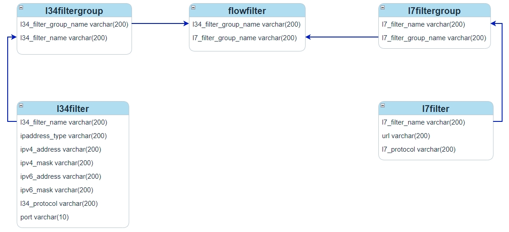
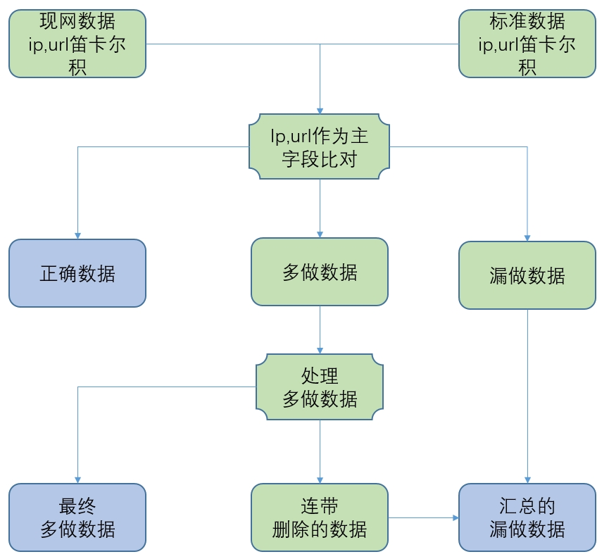

= 内容计费三七层数据核查详细设计

== 背景

内容计费业务是一种基于内容价值的计费方式，用于针对不同业务、不同内容、不同带宽、不同体验等制定不同的计费策略或计费方式

内容计费业务的工作原理是：运营商对上下行IP数据包进行包过滤和分析，在原始话单文件中标识出相关业务种类，然后将这些标识有内容类型的信息传送到运营商的内容计费平台中，平台利用这些信息完成解析、匹配、批价、账务、客服等一系列计费相关工作

IP数据包的过滤是通过网元上的相关过滤器配置数据实现的，因此局数据系统需要核查这些配置数据的准确性，过滤器配置数据可以划分为三层数据、七层数据和三七层数据，本文介绍最复杂的三七层数据的核查逻辑

== 数据模型

不同厂商的配置数据模型大同小异，本文以中兴UPF网元为例进行说明，它包含下面几个数据模型

如上图所示l34filter是对ip的过滤，l34filtergroup可以把多个l34filter划分到一组，l7filter是对域名的过滤，l7filtergroup可以把多个l7filter划分到一组，flowfilter把l34filtergroup和l7filtergroup关联起来实现ip和域名的同时过滤也就是ip和域名存在多对多关系

TIP: ip和域名的多对多关系不难理解，中大型系统都包含多个域名，例如百度就有 `tieba.baidu.com`、`zhidao.baidu.com`、`wenku.baidu.com` 等多个子域名，而这些子域名最终还是由同一组服务器集群提供服务的也就是ip相同

== 难点

ip域名的多对多关系给局数据核查制作带来很大困难，以增量核查为例，假设存在如下的现网数据和标准数据

.现网数据
|===
|ip |l34filter_name |l34filtergroup_name |flowfilter_name |l7filtergroup_name |l7filter_name |url

|1.1.1.1
|l34f1
.2+^.^|l34fg1
.2+^.^|ff1
.2+^.^|l7fg1
|l7f1
|baidu.com

|3.3.3.3
|l34f2
|l7f2
|qq.com
|===

.标准数据
|===
|ips |urls |operation_flag

|1.1.1.1,2.2.2.2
|baidu.com,douyin.com
|新增

|3.3.3.3
|baidu.com
|删除
|===

可以看到标准数据删除的部分在现网中是存在的，但又无法直接删除，因为flowfilter建立起来的是多对多的关系，无法直接删掉其中的一条一对一关系，因此只能选择删除l34filtergroup中的一个l34filter或者删除l7filtergroup中的一个l7filter，再把多删的数据补回来

新增的标准数据也是一样，它的一部分在现网中已经存在，因此同样需要把多个ip对应多个url做笛卡尔积得到多条ip与url的对应关系，只新增那些现网不存在的部分

|===
|ip |url

|#1.1.1.1#
|#baidu.com(现网已经存在无需新增)#

|1.1.1.1
|douyin.com

|2.2.2.2
|baidu.com

|2.2.2.2
|douyin.com
|===

NOTE: 上一章l34filter除了ip之外还包含了port、protocol信息，但它的核心仍然是ip，l7filter类似也类似，模型中除了url之外还有protocol，本章以及下文为了便于说明仅使用它们关键的部分ip和url，实际开发时需要考虑其它字段

== 核查方法

l3filter和l7filter可以跟其它模型一样单独进行核查，只是要注意对标准数据中的ip和url进行去重处理，而l34filtergroup、flowfilter、l7filtergroup则需要按照上图所示的流程进行核查，下面对流程中的关键步骤做进一步说明

=== 处理多做数据

多做数据中的每一个flowfilter按照下面的方法得到删除和保留的ip、url

假设现网一个flowfilter的数据如下所示，标黄的是多做的数据，此时有两种删除方案，一种是从l34filtergroup中删除 `1.1.1.1` 和 `2.2.2.2` 两个ip再添加这两个ip对应url为 `qq.com` 的数据，另一种删除方案是从l7filtergroup中删除 `baidu.com`，再添加 `baidu.com` 对应ip为 `3.3.3.3` 的数据，显然第二种方案删除的少添加的也少应该选择它

TIP: 代码实现此选择算法时首先计算保留数据中每个ip对应的域名，把对应域名相同的ip归为一组，得到ip域名数量最多的组，再以类似的方法计算每个域名对应的ip，最终从两个最佳方案中选择ip域名数量多的一个即可

|===
|ip |domain

|#1.1.1.1#
|#baidu.com#

|1.1.1.1
|qq.com

|#2.2.2.2#
|#baidu.com#

|2.2.2.2
|qq.com

|3.3.3.3
|baidu.com

|3.3.3.3
|qq.com
|===

明确了删除方案后后ip和url都被分成了两部分

|===
|ip |url

|#删除的ip#
|#删除的url#

|留下的ip
|留下的url

|===

相交得到如下四部分

* 删除的ip *X* 删除的url
* 留下的ip *X* 删除的url
* 删除的ip *X* 留下的url
* 留下的ip *X* 留下的url

前三部分可能包含了不该删除的数据需要被加回来，前三部分数据减去一开始需要删除的数据就得到 `连带删除的数据`，如果仍然使用上面的示例就得到如下结果

|===
|ip |url

|#删除的ip为空#
|#删除的url为baidu.com#

|留下的ip为1.1.1.1,2.2.2.2,3.3.3.3
|留下的url为qq.com

|===

由于删除的ip为空就不需要考虑 `删除的ip *X* 删除的url` 和 `删除的ip *X* 留下的url` 这两种情况了，只需要考虑 `留下的ip *X* 删除的url` 这一种，那么就可以得到 `3.3.3.3-baidu.com` 就是连带删除的数据，需要后面补回来

=== 处理漏做数据

漏做数据包含了一开始使用ip和url作为主字段比对现网数据和标准数据得到的漏做数据以及处理多做时产生的的连带删除数据，漏做的数据需要新增， [red]#新增的原则是数据最少化，新增尽量少的l3filtergroup、l7filtergroup、flowfilter#

为了实现新增数据最少化，首先对漏做的标准数据进行合并，同一个ip对应的多个url合并为一组，对应的url组相同的ip也合并为一组，最终得到多个 `ip组-url组`

对新增数据分组后还需要考虑处理的顺序，假设存在如下的现网数据和需要新增的数据，如果按照顺序先新增 `2.2.2.2-baidu.com,qq.com` 那就需要新增一个l34filtergroup、一个l7filtergroup、一个flowfilter，但是如果是先处理 `1.1.1.1-qq.com` 那就只需要在现网已经存在的l7filtergroup上添加一条数据即可，并且紧接着处理下一条 `2.2.2.2-baidu.com,qq.com` 时再在已经存在的l34filtergroup上添加一条数据即可，无需新增任何的l34filtergroup、l7filtergroup、flowfilter

.现网数据
|===
|ip |url

|1.1.1.1
|baidu.com
|===

.需要新增的数据
|===
|ip |url

|2.2.2.2
|baidu.com,qq.com

|1.1.1.1
|qq.com
|===

=== 处理错做数据

l34filter_name、l34filtergroup_name、l7filter_name、l7filtergrou_name、flowfilter_name都有命名规范，若命名不符合规范可以认为是错做，但由于核查是把ip和url做笛卡尔积后进行的，因此对于错做的处理非常复杂。所以直接把错做的数据看作一条多做和一条漏做即可，这样就可以使用上文介绍的多做的处理方法和漏做的处理方法

== 全量核查与增量核查

相比增量核查全量核查需要额外处理下面两部分数据：

1. 正确数据保存在核查结果中
2. 未被任何flowfilter使用的l3filtergroup和l7filtergroup作为多做数据保存在核查结果中
