= 第一次住院
pxzxj; pudge.zxj@gmail.com; 2026/07/29

== 病史

从不曾想过自己会得这么麻烦的病，自从2018年末第一次发现便血以来日益严重，2020年后也逐渐有脱出的问题，到了最近两年甚至影响到了日常生活，
2024年中一次夜跑后发作此后不敢再跑步，而2026年春节在家期间每次便后会持续超过一个小时的坠胀疼痛

为了这个毛病这些年也是屡次就医以及不断在网上查询解决方法，有的医生建议手术有的医生又不建议手术，
有的病友表示手术很成功有的病友又表示手术后悔一辈子，再加上大家一致表示手术异常疼痛，因而我也迟迟拿不定主义

2024年中就打算手术，但后来浙一医院的医生不建议手术加上两天后就不再便血于是也就放弃了，
而在2025年则是在已经住院手术前几个小时又放弃了浪费了不少检查费用，因为旁边病床的人介绍说这个手术超级疼痛

== 问诊

在今年4月再一次便血超过一周后终于下定决心去做手术，定下来要做手术那么最重要的就是医院的选择了，
一开始还是先去了杭州比较有名的浙二医院，医生简单指检和问询后表示可以预约手术但是要排队两周左右，
我想着再去其它医院问诊就以工作未交接好为由表示后面再来预约。
紧接着去的是一个前同事标哥推荐的903医院，他在2018年就是在这家医院手术治好的，他表示这里的医生都很厉害，
由于这家医院名气实在是太小我一直有些怀疑（不论是小红书还是抖音都搜不到什么评价），
但还是在4月9日挂了标哥推荐的林主任的号，挂号费相比于一些知名医院的专家号来说非常便宜，为此我又质疑了林主任的水平😅

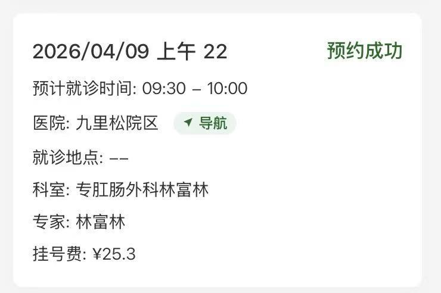

903医院分为机场路和九里松两个院区，这天去的是九里松院区，进去后人不多大部分是些穿迷彩服的军人，我取了号后上了二楼就是林主任的办公室，前面也没人于是完全不用等直接就见到了林主任，
林主任戴着眼镜，瘦瘦高高，是北方人的四方头，看起来平易近人，他很耐心地细细询问我整个病史，在我提出去年做过肠镜后又看了我的肠镜报告
（中间我从相册翻找肠镜报告找了四五分钟没找着他一直都耐心地在等着，最后还是去浙大一院小程序找到了），最后也做了指检，确定进行手术后详细介绍了手术及住院的细节，
其中我最喜欢的是手术是局部麻醉不会影响手术后小便（最后还是有影响😭），还有就是他表示手术只需要住院一周甚至三四天，手术及住院都要到机场路院区进行

尽管最终手术的情况并没有林主任介绍的那么乐观，但这仍然是我在杭州最好的一次就医体验，整个过程超过二十分钟，林主任全程都很耐心细致甚至连去机场路院区怎么坐地铁都有记下来，
于是我就不再迷茫决定就在903医院进行手术。由于还有些未完成的工作，最后跟林主任约定一周后住院

.九里松院区
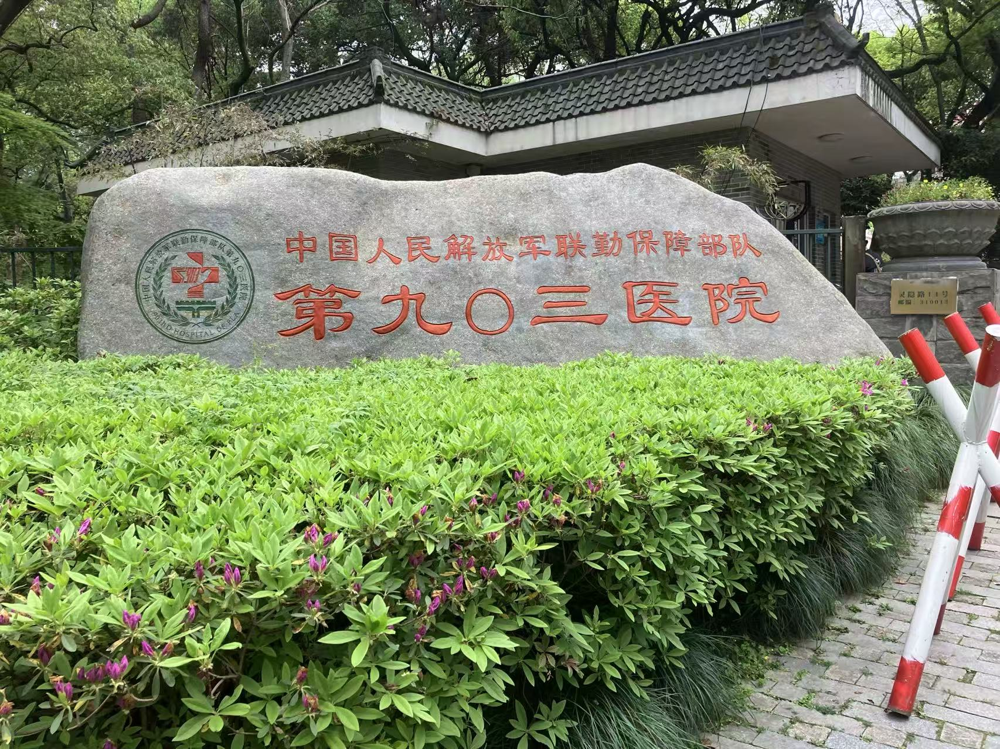

== 入院

4月20日星期一早上9点从家出发坐二号线转一号线在闸弄口站A口出站就是机场路院区了，
机场路院区也不大，主要就是门诊楼和住院部两幢楼，在住院部一楼的窗口排队几分钟后就办好了入院手续，收了三千押金发了手环

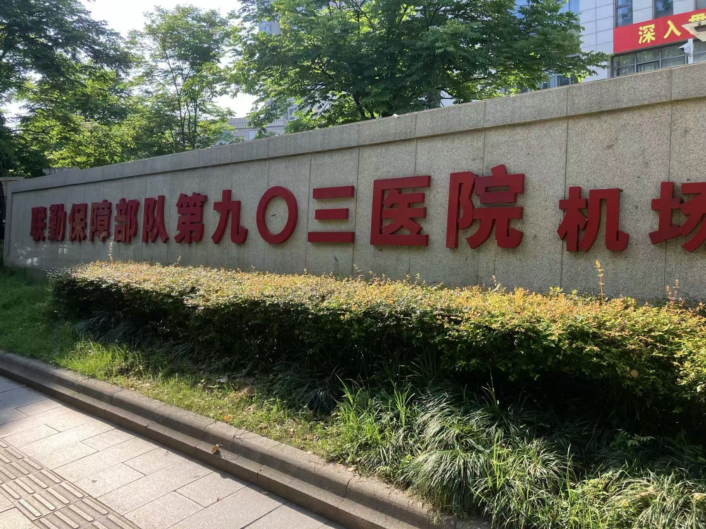

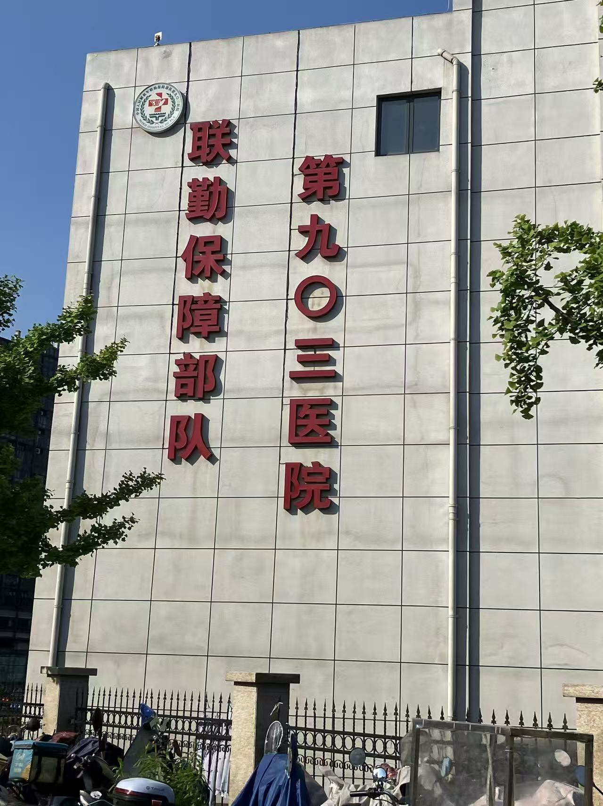

肛肠科位于住院部的9层，上去后走廊空空荡荡除了护士没看到任何人，这一点和前一年在立同德医院入院时的喧闹情形大不相同，毫无疑问我更喜欢这里

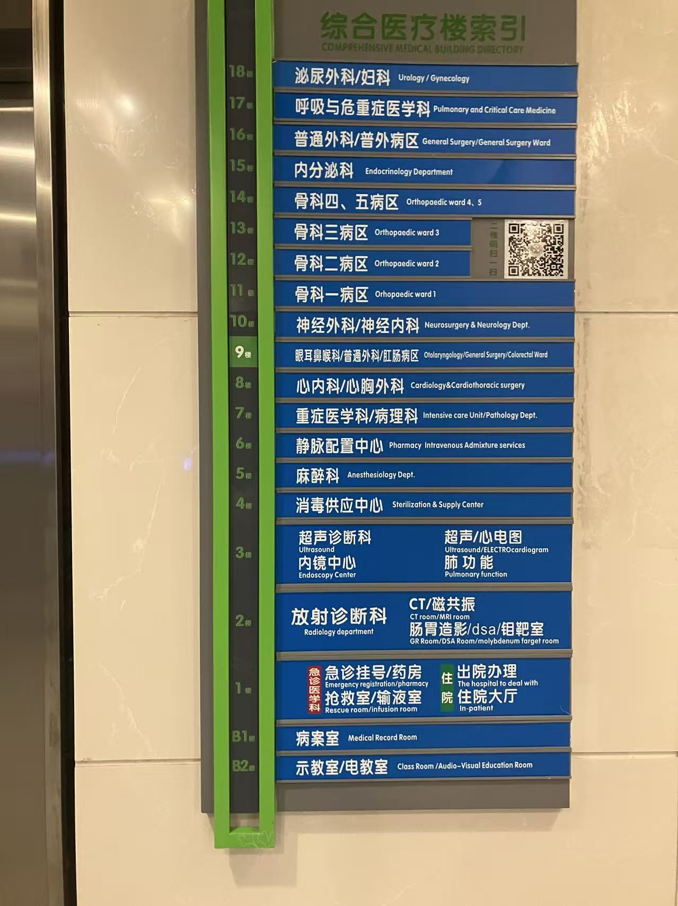

填了几张表后护士就带着到了病房，病房是三人间，我被安排到了靠近门口的9号床，中间床空着，里面床是一个肛周脓肿患者不过已经接近康复两天后就出院了

靠门口床位有个好处是更靠近洗手间😊

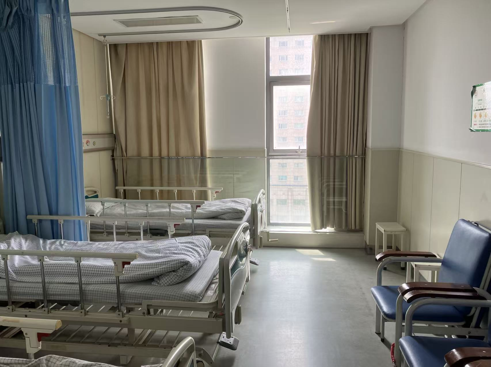

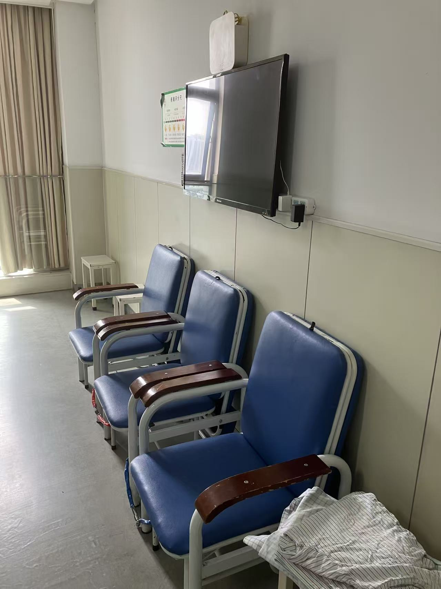

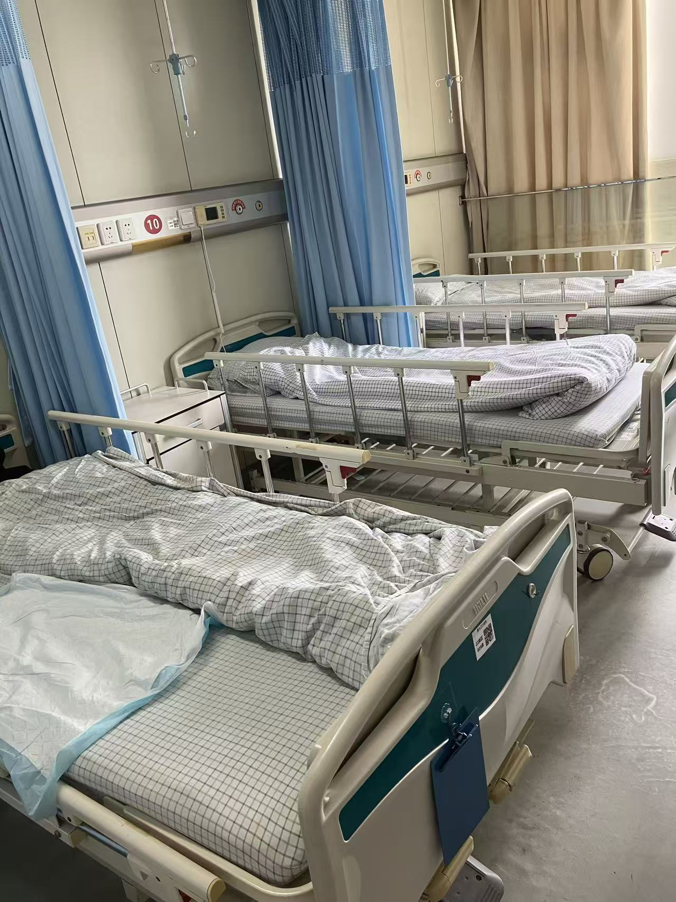

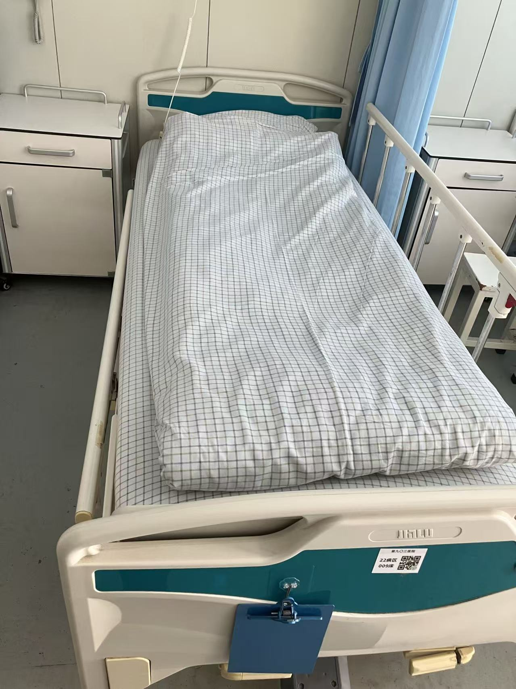

安排病床后护士又开了中午要吃的药还有需要做的检查单，主要还是些基础的彩超心电图之类，比较特殊是一个肛门彩超第一次做

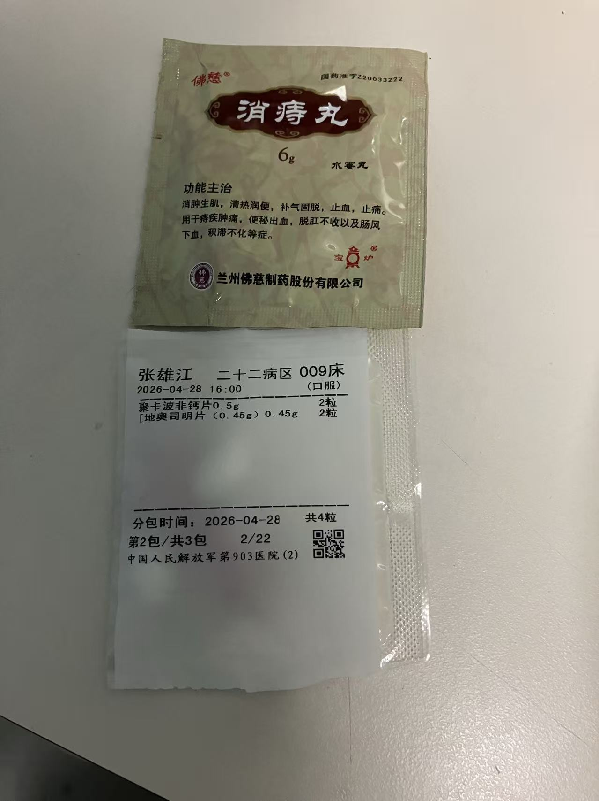

下午负责我的罗小龙医生和陈思齐医生过来了了解了些基本情况介绍了手术相关的东西并告知第二天手术，于是这天剩下的时间就和往常一样了正常吃饭休息躺病床上玩手机

== 手术

手术安排在了第二天也就是4月二十一号的下午，早饭和午饭都可以正常吃，
不过临近中午护士送药时除了上面两种药外还有一瓶开塞露要求在手术前一小时用完，
这是我第一次用开塞露没想到它的功效如此强大😧，断断续续用了几次感觉完全排便干净了

下午两点十几分终于还是到了手术室门外，再过10分钟就到了手术台上，手术时需要保持侧躺姿势，上侧腿弯曲到腹部

手术的第一步是打麻药，在肛门周围打6针左右，疼痛自然是免不了的😧
麻药之后是扩肛以及手术，尽管有麻药但仍然是异常疼痛还要忍受便意，医生建议可以通过玩手机来转移注意力，
但是在这样极度的痛苦下我也完全不能从手机上获得什么快乐了，但还是随意地刷了几个短视频。
手术时医生也表示我的情况确实已经非常严重应该更早来做手术的

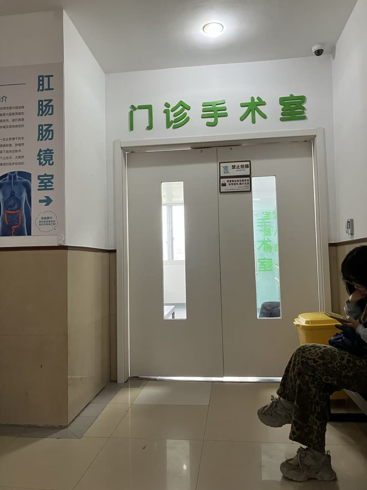

好在这样的痛苦没有持续太长时间，全程约二十分钟，结束时医生塞了纱布在里面，之后坐在轮椅上由护工推回了病房

手术后紧接着就是挂水，一直从下午3点到7点才全部挂完，
中间还有一件痛苦的事情是小便，由于手术前喝了些水以及挂水输入到身体里面的水手术后约1个小时就特别想要小便，
但是尝试了两次都失败了，最后在手术后约两小时终于能够排出很少一部分，后面又陆续去了几次终于排干净

医生建议手术后要正常吃饭，于是挂水后外卖简单点了一份馄饨

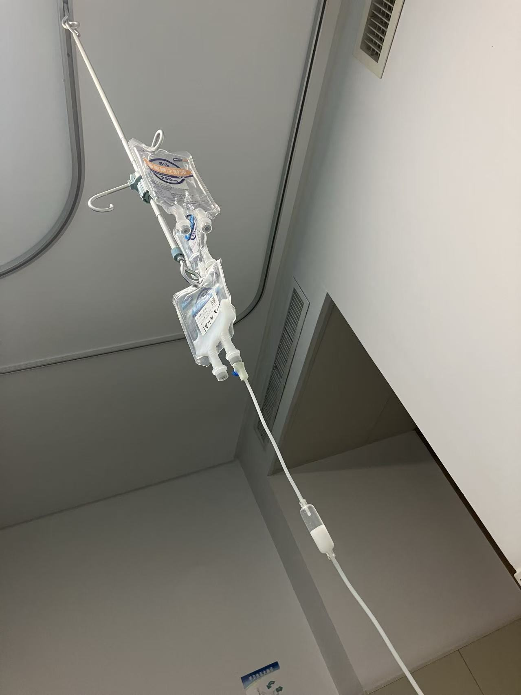

== 住院

手术当天晚上挂水后疼痛减轻了很多，睡眠也还行，第二天一早还跑到楼下去买了早饭，
第二天一整天都没有大便因而这一天除了肛门的堵塞感外总体过地比较轻松，
但是我知道最大的挑战还没有到来，我已经在网络上看到过太多病友提到了第一次大便时拉玻璃碴的非人痛苦

第三天早上刚起床就感觉到很强的便意，塞的纱布也可以拿掉，紧接着就是最痛苦的过程了，
可能是医生开的药的效果总体还算顺利，虽然确实很痛但没有到满头大汗拉玻璃碴的地步，
痛苦并不会随着大便结束就结束，之后也还是会持续，这种特殊的坠胀痛感没得过这个病的人是无法体会的，
我发现保持趴着右膝贴腹部的姿势能够稍微减轻一点痛苦，于是除了吃饭上厕所之外都是保持着这样的姿势在床上玩手机

此后的几天基本上也都是前面一天的重复，生活也变得规律，晚上10点左右就要准备睡觉，
早上保洁阿姨五点多就要进来打扫卫生，护士6点左右要来量血压因而每天也都醒很早
，不过术后第一周由于疼痛每天大概只能睡三到四个小时有一天半夜吃了止疼药才睡着（不过感觉止疼药没啥效果）。
每天最重要的事情是早期排便，术后一周排便疼痛并没有减轻但是出血量还是能看出来逐渐变少，
到了术后第二周最明显的变化在于下午和晚上疼痛减轻了很多，上午由于要排便还是很疼

术后的护理也很重要，每天的护理工作包括坐浴、烤灯、中药薰，此外前三天还要挂水和护士过来肛门消毒

.坐浴15分钟
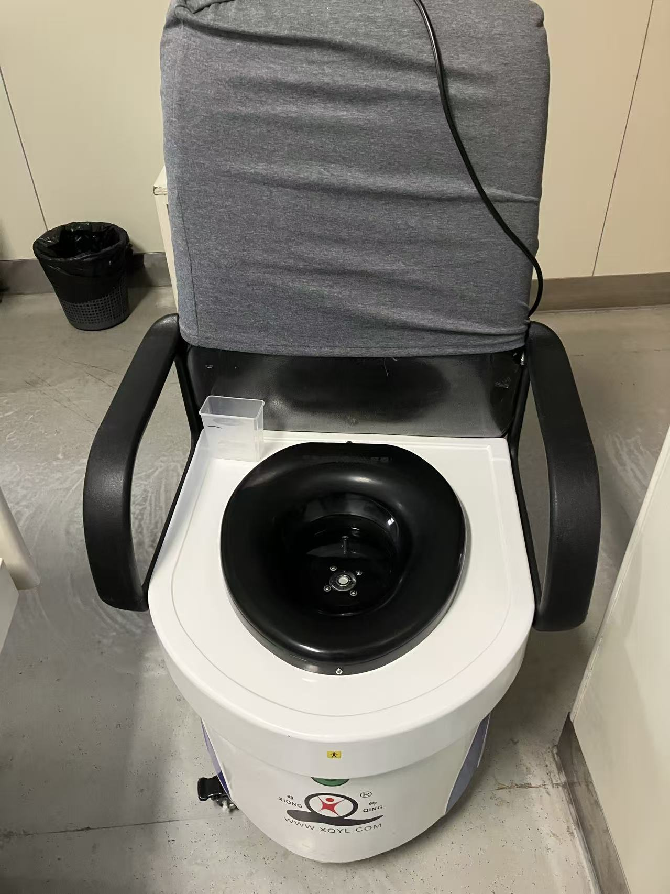

.烤灯15分钟
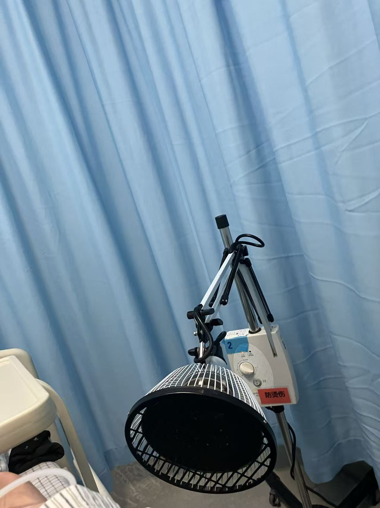

.喷的药
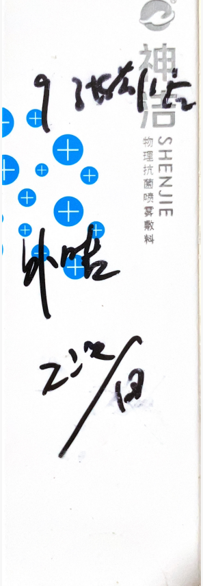

住院期间吃饭基本都是靠外卖，早饭则通常是面包，外卖需要自己下楼去拿，下楼这短短一段路也并不容易，需要忍者疼痛蠕动着走。
我最常点的是外婆家和老娘舅的外卖，为了促进消化还会额外点一份火龙果香蕉果切

.外婆家
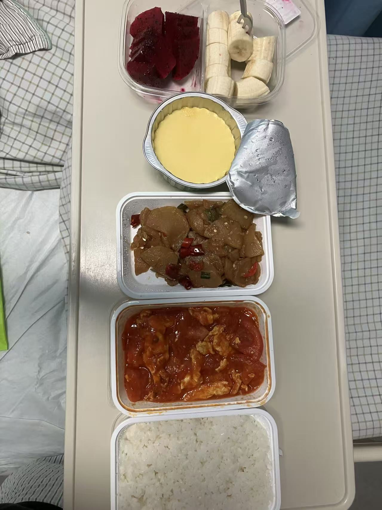

住院的后期下午跟晚上没那么疼痛也会在走廊散步或者看看窗外的风景，住院期间可能因为林主任不在病人很少整个楼层都很安静，我的病房在很长时间也都只有我一个人住，
这里也要为护士们点个赞，在病人没那么多的时候他们也会特意把病人分散在多个病房而不是集中在一起，给病人和陪护足够的空间

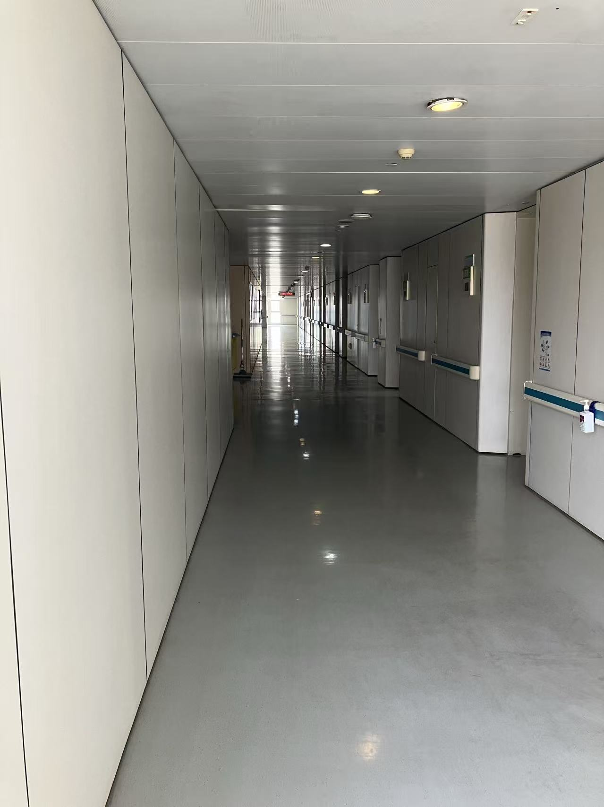

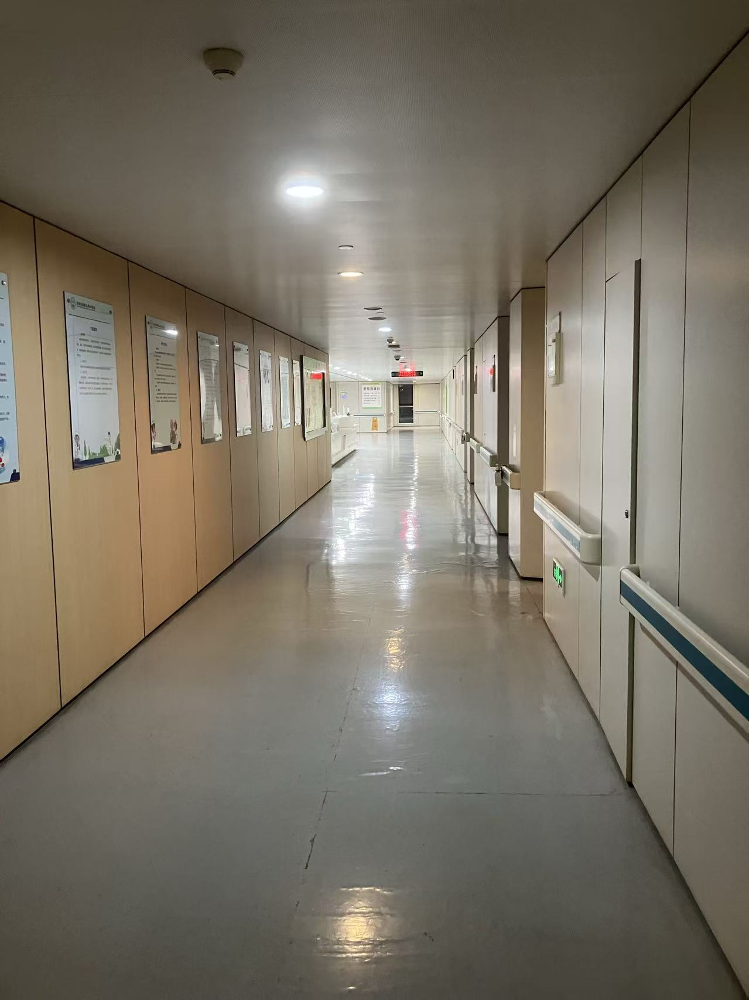

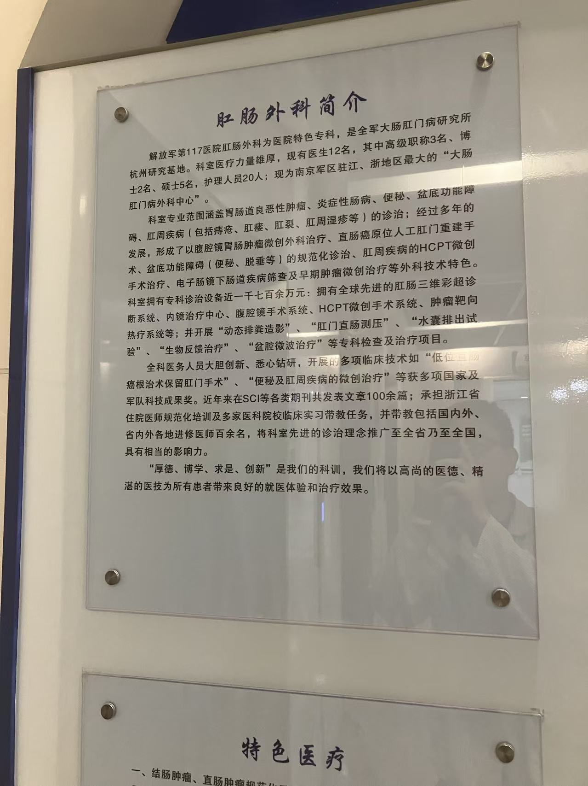

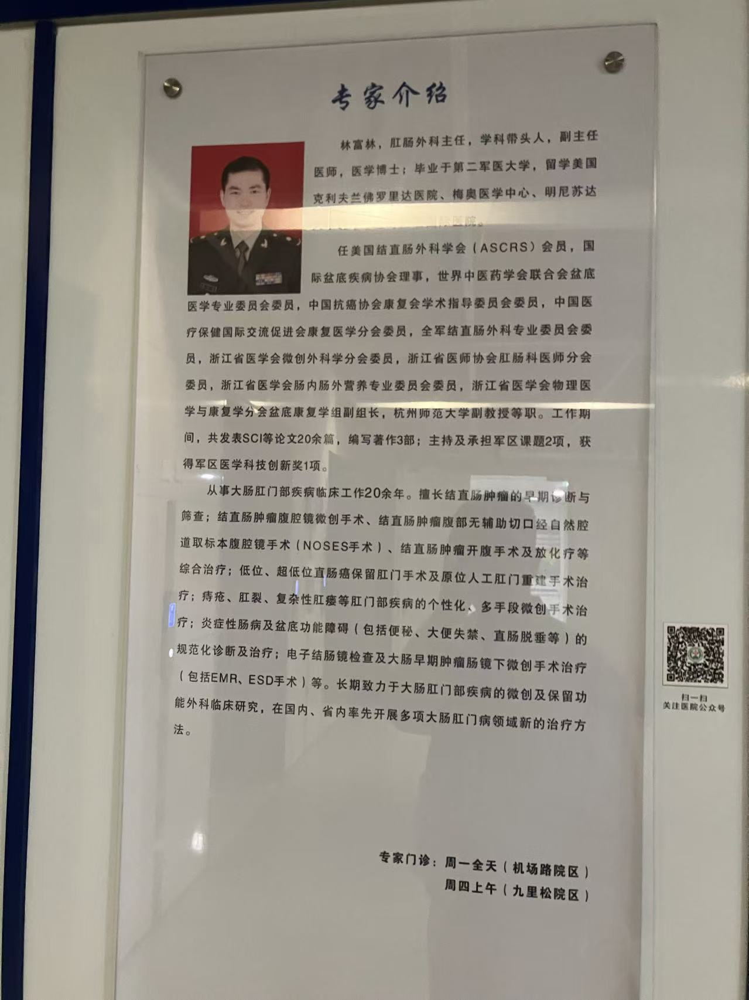

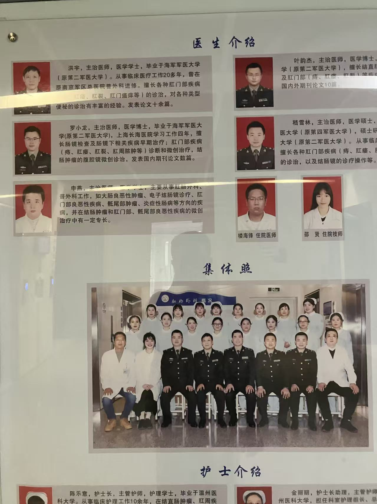

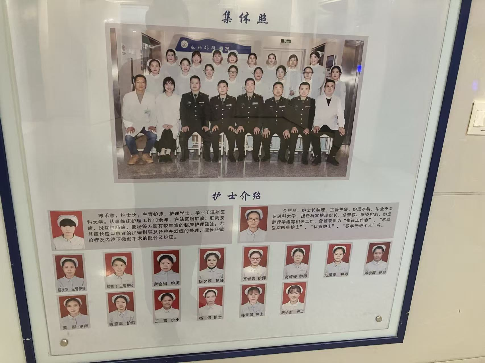

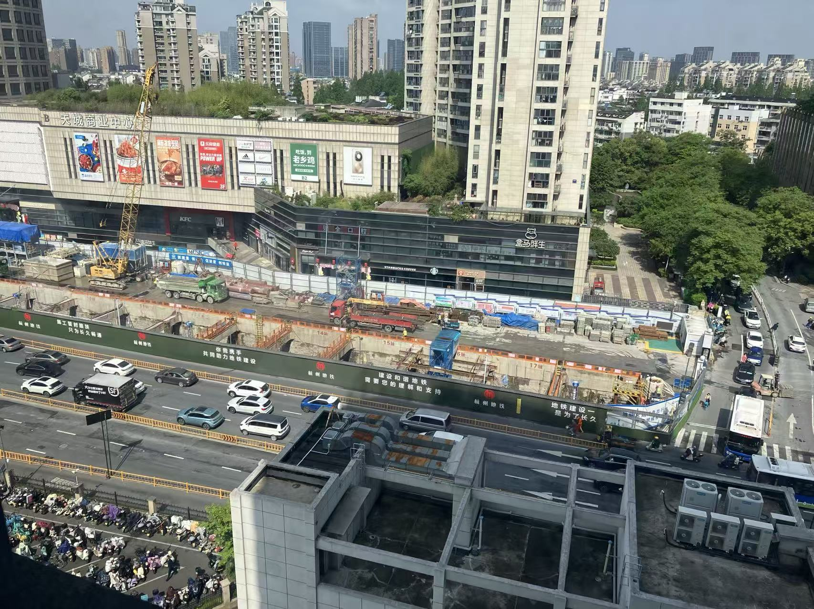

== 出院

住院近两周后疼痛已经好了很多，跟医生讨论后觉得再继续住院意义不大了于是在5月3日下午办理了出院手续，
住院近两周加上手术总花费一万多，需要自费四千左右完全医保报销，住院时的三千押金全部退回

出院时医生开了几盒住院时就一直在吃的药

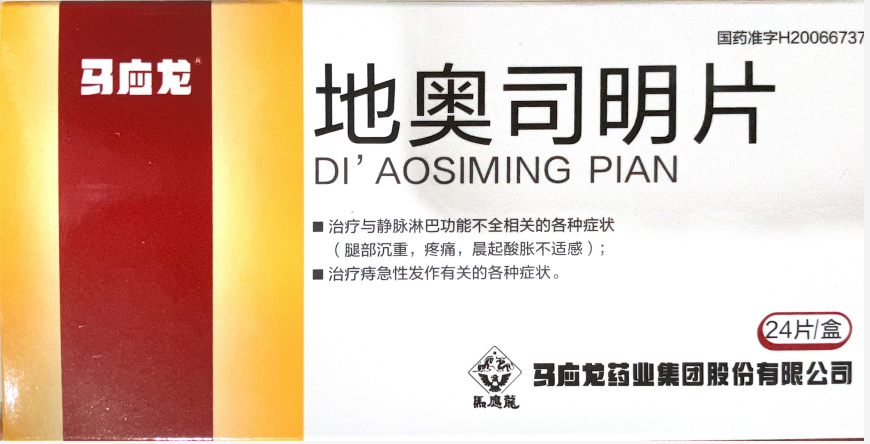

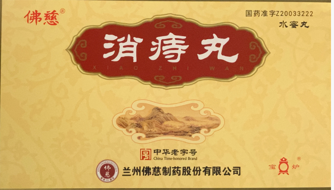

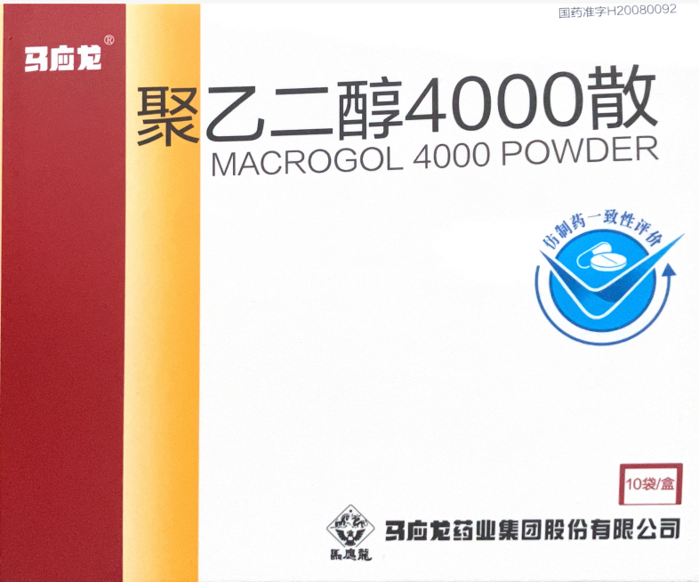

== 恢复

五一假期之后开始上班，由于大便后仍然疼痛因此前两周只在下午去上班，之后恢复正常上班

出院后半个月疼痛基本消失，按照医嘱去复查医生表示恢复很好不过还是开了半个月的药这也是最后一次服药了

又过三周去复查医生表示还有伤口未长好，个人确实偶尔还能感觉到疼痛，不过更多的是出汗后的瘙痒感，继续坚持坐浴

现在7月29日手术后马上一百天瘙痒感也几乎没有了但仍然有一点点继续坚持✊