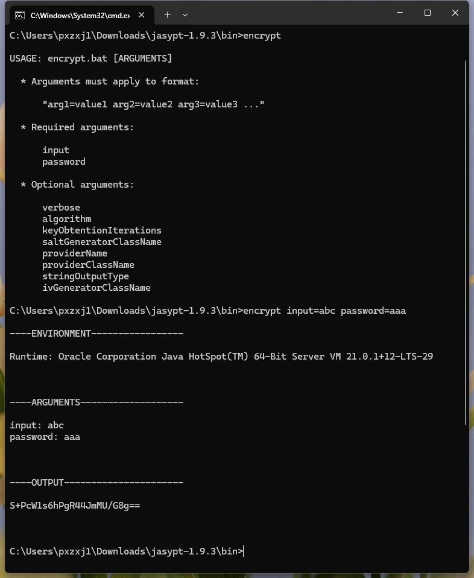
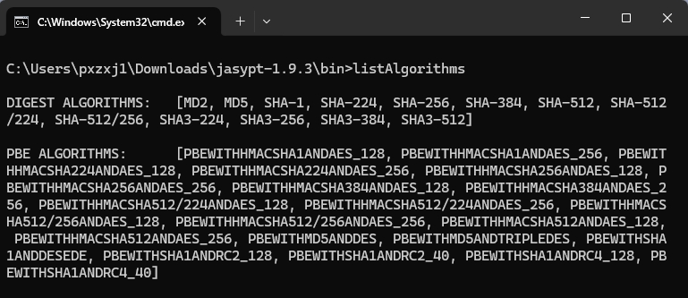
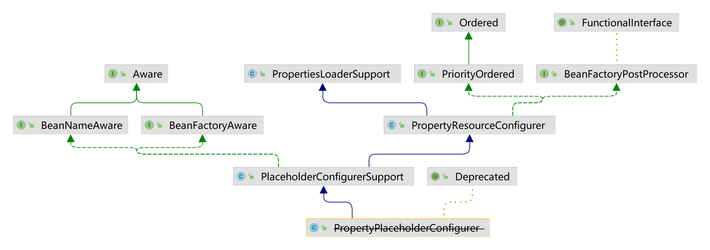
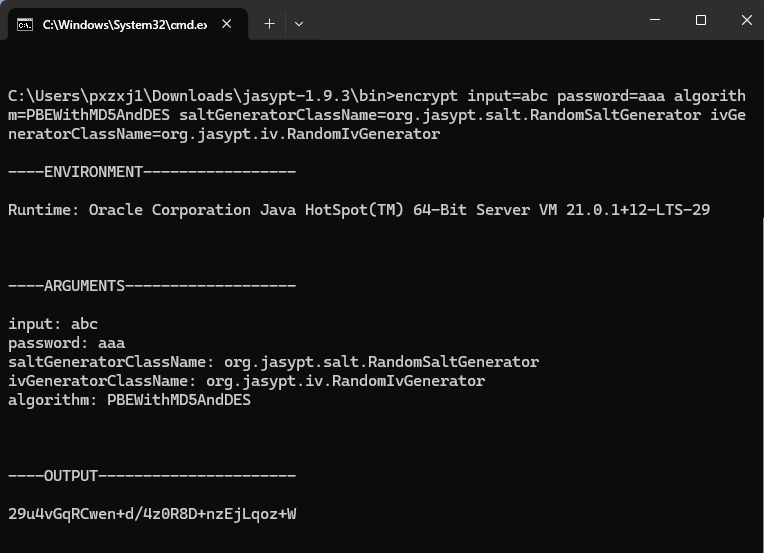

= Jasypt实现配置文件加密
pxzxj; pudge.zxj@gmail.com; 2025/04/22

== 简介

jasypt是一个加解密的Java类库，名称取自Java Simplified Encryption的首字母组合。作者是 http://www.jasypt.org/team.html[Daniel Fernández]——他也是流行的模板引擎 http://www.thymeleaf.org/[thymeleaf]的作者。它使开发者能够非常轻松地使用常用的加密算法和摘要算法对密码、文本、数字以及二进制数据进行加密，而不需要了解密码学的实现细节

== 下载

jasypt的源码托管在 https://github.com/jasypt/jasypt[github]上，可以在release中下载相关jar包。

jasypt的jar包分为下面几类：

* jasypt包含了核心代码
* jasypt-spring用于jasypt和spring框架整合时使用
* jasypt-springsecurity用于jasypt和springsecurity框架整合时使用
* jasypt-hibernate用于jasypt和hibernate框架整合时使用

如果是maven项目，添加如下依赖即可，目前最新版本为1.9.3，artifactId可以根据项目需求从上面介绍的jar包中选择

[source,xml,subs="verbatim"]
----
<dependency>
    <groupId>org.jasypt</groupId>
    <artifactId>jasypt-spring4</artifactId>
    <version>1.9.3</version>
</dependency>
----

== 基础用法

=== 消息摘要

消息摘要通常用于验证文件或数据完整性，使用单向加密算法，任意大小的文件或数据都会生成固定长度的摘要字符串，`org.jasypt.util.digest.Digester` 用于生成消息摘要

[source,java,subs="verbatim"]
----
Digester digester = new Digester();
digester.setAlgorithm("SHA-1");
String message = "hello";
byte[] digest = digester.digest(message.getBytes());
----

=== 密码加密

为了保证密码不能被破解，通常也是使用单向加密算法进行加密，这一点与上文的计算消息摘要是类似的，但密码的安全要求更高，如果密码被破解就意味着用户的一切隐私都会被攻击者获取，所以在对密码进行加密时通常要遵循以下原则：

* 使用至少8个字节的salt与密码一起计算摘要，这样是为了防止相同的用户密码计算的摘要也相同
* 计算摘要时至少迭代1000次，增加密码暴力破解的难度
* 计算摘要前使用固定的编码将字符串转为字节数组，避免不同平台默认编码不同导致密码验证失败

整个密码加密的过程可以用下图来说明

.Password encryption process
image::http://www.jasypt.org/images/passwordEncryption.png[]

`org.jasypt.util.password.BasicPasswordEncryptor` 可以用于加密密码也可以用于登录时校验密码

[source,java,subs="verbatim"]
----
String userPassword = "1qaz";
BasicPasswordEncryptor passwordEncryptor = new BasicPasswordEncryptor();
String encryptedPassword = passwordEncryptor.encryptPassword(userPassword);
String inputPassword = "!QAZ";
if (passwordEncryptor.checkPassword(inputPassword, encryptedPassword)) {
    // correct!
} else {
    // bad login!
}
----

`org.jasypt.util.password.StrongPasswordEncryptor` 实现了更强的密码安全性，实质上就是做了更复杂的加密运算

[source,java,subs="verbatim"]
----
String userPassword = "1234";
StrongPasswordEncryptor passwordEncryptor = new StrongPasswordEncryptor();
String encryptedPassword = passwordEncryptor.encryptPassword(userPassword);
String inputPassword = "!@#$";
if (passwordEncryptor.checkPassword(inputPassword, encryptedPassword)) {
    // correct!
} else {
    // bad login!
}
----

=== 文本加密

文本加密需要使用双向加密算法，能够解密还原明文

`org.jasypt.util.text.BasicTextEncryptor` 使用正常复杂度的加密算法实现文本加解密，加解密前需要先设置密码

[source,java,subs="verbatim"]
----
BasicTextEncryptor textEncryptor = new BasicTextEncryptor();
String myEncryptionPassword = "123456";
textEncryptor.setPassword(myEncryptionPassword);
String myText = "myText";
String myEncryptedText = textEncryptor.encrypt(myText);
String plainText = textEncryptor.decrypt(myEncryptedText);
----

`org.jasypt.util.text.StrongTextEncryptor` 使用复杂度更高的机密算法实现加解密，使用方法与BasicTextEncryptor类似

=== 配置文件加密

jasypt提供了 `org.jasypt.properties.EncryptableProperties` 用于加载包含加密内容的.properties配置文件，配置文件中可以混合使用明文的value和加密后的value，只需要将加密后的value放在 `ENC(...)` 内

例如一个数据库的配置文件内容为：

[source,properties,subs="verbatim"]
----
datasource.driver=com.mysql.jdbc.Driver
datasource.url=jdbc:mysql://localhost/reportsdb
datasource.username=reportsUser
datasource.password=ENC(G6N718UuyPE5bHyWKyuLQSm02auQPUtm)
----

使用EncryptableProperties读取配置文件内容：

[source,java,subs="verbatim"]
----
 /*
  * 首先，创建一个用于加解密的StringEncryptor并设置加密算法和加解密的密码
  *
  */
 StandardPBEStringEncryptor encryptor = new StandardPBEStringEncryptor();
 encryptor.setPassword("jasypt"); // could be got from web, env variable...
 encryptor.setAlgorithm("PBEWithHMACSHA512AndAES_256");
 encryptor.setIvGenerator(new RandomIvGenerator());

 /*
  * 创建EncryptableProperties的实例并加载配置文件
  */
 Properties props = new EncryptableProperties(encryptor);
 props.load(new FileInputStream("/path/to/my/configuration.properties"));

 /*
  * 使用相同的方式获取加密内容和未加密内容，EncryptableProperties会自动对ENC(...)格式的内容进行解密
  */
 String datasourceUsername = props.getProperty("datasource.username");
 String datasourcePassword = props.getProperty("datasource.password");
----

上面的示例中直接将加解密的密码写死在代码中，这样仍然不够安全，推荐使用环境变量保存密码，读取密码后删除或重置对应的环境变量

== 命令行工具

jasypt提供了几个工具用于命令行下进行密码加解密、计算消息摘要。

在jasypt的git仓库的release中找到jasypt-$VERSION-dist.zip下载并解压，bin目录中包含下面几个脚本，.bat和.sh的版本分别用于Windows和Linux下使用：

* `encrypt`: 基于密码的加密操作
* `decrypt`: 基于密码的解密操作
* `digest`: 计算消息摘要
* `listAlgorithms`: 列出支持的摘要算法和加密算法

使用encrypt加密的示例如下，输入参数必须包含input和password，代表加密内容和密码

listAlgorithms可以列出支持的摘要算法和加密算法如下

== Spring配置加密

=== 使用方式

如下面示例所示，spring项目中通常使用 `PropertyPlaceholderConfigurer` 加载配置文件，它可以对bean中的属性值进行占位符替换；如果配置文件中的属性值进行了加密，只需要将 `PropertyPlaceholderConfigurer` 替换为 `org.jasypt.spring4.properties.EncryptablePropertySourcesPlaceholderConfigurer` 并提供一个 `StringEncryptor` 的实例用于对配置内容进行解密。此处使用了 `StringEncryptor` 的标准实现 `StandardPBEStringEncryptor` 并配置它使用 `PBEWithMD5AndDES` 加密算法，密码从环境变量 `APP_ENCRYPTION_PASSWORD` 中读取；服务启动后可以删除或重置此环境变量以免被攻击者获取。

配置文件中的密文可以执行上文介绍的命令行工具encrypt获取，注意密文需要包裹在 `ENC(...)` 内，用于和明文区分。

[source,xml,subs="verbatim"]
----
<!-- 原来的配置文件加载类，用于替换bean定义中的占位符 -->
<!--
<bean id="propertyConfigurer" class="org.springframework.beans.factory.config.PropertyPlaceholderConfigurer">
    <property name="locations">
        <list>
            <value>classpath:dataSource.properties</value>
        </list>
    </property>
</bean>
-->

<!-- 使用PBEWithMD5AndDES的加密算法进行加解密,密码从环境变量APP_ENCRYPTION_PASSWORD中读取 -->
<bean id="environmentVariablesConfiguration"
      class="org.jasypt.encryption.pbe.config.EnvironmentStringPBEConfig">
    <property name="algorithm" value="PBEWithMD5AndDES" />
    <property name="passwordEnvName" value="APP_ENCRYPTION_PASSWORD" />
</bean>

<bean id="configurationEncryptor"
      class="org.jasypt.encryption.pbe.StandardPBEStringEncryptor">
    <property name="config" ref="environmentVariablesConfiguration" />
</bean>

<!-- 替换PropertyPlaceholderConfigurer并提交构造器参数 -->
<bean id="propertyConfigurer" class="org.jasypt.spring4.properties.EncryptablePropertySourcesPlaceholderConfigurer">
    <constructor-arg ref="configurationEncryptor" />
    <property name="locations">
        <list>
            <value>classpath:dataSource.properties</value>
        </list>
    </property>
</bean>

<!-- 定义bean，占位符${...}会使用配置文件中对应的属性值进行替换 -->
<bean id="dataSource" class="com.alibaba.druid.pool.DruidDataSource">
    <property name="username" value="${druid.username}" />
	<property name="password" value="${druid.password}" />
	<property name="driverClassName" value="${druid.driverClassName}" />
</bean>
----

=== 实现原理

==== PropertyPlaceholderConfigurer原理

在介绍 `EncryptablePropertySourcesPlaceholderConfigurer` 前有必要先介绍 `PropertyPlaceholderConfigurer` 的原理，它是如何实现bean属性值的占位符替换的呢？

从 `PropertyPlaceholderConfigurer` 的继承关系可以看出它实现了 `BeanFactoryPostProcessor` 接口，熟悉spring设计的人都了解 `BeanFactoryPostProcessor` 正是spring提供给开发者的扩展接口，在它的 `postProcessBeanFactory` 中开发者可以修改bean的定义信息，因为此时所有的bean都还没有实例化

[source,java,subs="verbatim"]
----
public interface BeanFactoryPostProcessor {

	/**
	 * Modify the application context's internal bean factory after its standard
	 * initialization. All bean definitions will have been loaded, but no beans
	 * will have been instantiated yet. This allows for overriding or adding
	 * properties even to eager-initializing beans.
	 * @param beanFactory the bean factory used by the application context
	 * @throws org.springframework.beans.BeansException in case of errors
	 */
	void postProcessBeanFactory(ConfigurableListableBeanFactory beanFactory) throws BeansException;

}
----

那么 `PropertyPlaceholderConfigurer` 在 `postProcessBeanFactory` 中完成了哪些工作呢

[source,java,subs="verbatim"]
----
public class PropertyPlaceholderConfigurer extends PlaceholderConfigurerSupport {

    /**
     * 该方法实际在PropertyResourceConfigurer中，可以通过上面的继承关系图查看
     */
    @Override
	public void postProcessBeanFactory(ConfigurableListableBeanFactory beanFactory) throws BeansException {
		try {
            //加载.properties中的配置信息
			Properties mergedProps = mergeProperties();
            //转换mergedProps的value，如果有必要的话
			convertProperties(mergedProps);
			// Let the subclass process the properties.
			processProperties(beanFactory, mergedProps);
		}
		catch (IOException ex) {
			throw new BeanInitializationException("Could not load properties", ex);
		}
	}

	/**
	 * 查看beanFactoryToProcess中的所有BeanDefinition并使用props中的属性值替换${...}占位符
	 *
	 */
	@Override
	protected void processProperties(ConfigurableListableBeanFactory beanFactoryToProcess, Properties props)
			throws BeansException {

		StringValueResolver valueResolver = new PlaceholderResolvingStringValueResolver(props);
		doProcessProperties(beanFactoryToProcess, valueResolver);
	}

    //该方法实际定义在PlaceholderConfigurerSupport中
    protected void doProcessProperties(ConfigurableListableBeanFactory beanFactoryToProcess,
			StringValueResolver valueResolver) {

		BeanDefinitionVisitor visitor = new BeanDefinitionVisitor(valueResolver);

		String[] beanNames = beanFactoryToProcess.getBeanDefinitionNames();
		for (String curName : beanNames) {
			// Check that we're not parsing our own bean definition,
			// to avoid failing on unresolvable placeholders in properties file locations.
			if (!(curName.equals(this.beanName) && beanFactoryToProcess.equals(this.beanFactory))) {
				BeanDefinition bd = beanFactoryToProcess.getBeanDefinition(curName);
				try {
                    //使用Visitor模式修改属性值
					visitor.visitBeanDefinition(bd);
				}
				catch (Exception ex) {
					throw new BeanDefinitionStoreException(bd.getResourceDescription(), curName, ex.getMessage(), ex);
				}
			}
		}

		beanFactoryToProcess.resolveAliases(valueResolver);

		beanFactoryToProcess.addEmbeddedValueResolver(valueResolver);
	}

    //该方法实际在PropertyResourceConfigurer中
    protected void convertProperties(Properties props) {
		Enumeration<?> propertyNames = props.propertyNames();
		while (propertyNames.hasMoreElements()) {
			String propertyName = (String) propertyNames.nextElement();
			String propertyValue = props.getProperty(propertyName);
			String convertedValue = convertProperty(propertyName, propertyValue);
			if (!ObjectUtils.nullSafeEquals(propertyValue, convertedValue)) {
				props.setProperty(propertyName, convertedValue);
			}
		}
	}

    //该方法实际在PropertyResourceConfigurer中
    protected String convertProperty(String propertyName, String propertyValue) {
		return convertPropertyValue(propertyValue);
	}

    //该方法实际在PropertyResourceConfigurer中，默认返回原属性值
    protected String convertPropertyValue(String originalValue) {
		return originalValue;
	}
}
----

上述代码使用了模板方法模式，在父类 `PropertyResourceConfigurer` 的 `postProcessBeanFactory` 方法中定义了整个属性处理过程：先读取properties，然后转换部分属性值，最后执行处理逻辑，同时将 `convertProperties` 和 `processProperties` 声明为 `protected` 供子类具体实现，`PropertyPlaceholderConfigurer` 提供了 `processProperties` 的具体实现但没有实现 `convertProperties` 方法，也就是说 `convertProperties` 仍然返回的是原来配置文件读取到的属性值。

==== EncryptablePropertySourcesPlaceholderConfigurer原理

通过上文对 `PropertyPlaceholderConfigurer` 的介绍可以发现，spring实际上已经想到了可能需要对配置文件读取到的值进行转换，所以提供了 `convertProperties` 方法供子类实现， `EncryptablePropertySourcesPlaceholderConfigurer` 的解密逻辑正是在 `convertProperties` 方法内完成的

[source,java,subs="verbatim"]
----
public final class EncryptablePropertySourcesPlaceholderConfigurer
        extends PropertySourcesPlaceholderConfigurer {

    private final StringEncryptor stringEncryptor;

        @Override
	protected String convertPropertyValue(final String originalValue) {
		if (!PropertyValueEncryptionUtils.isEncryptedValue(originalValue)) {
			return originalValue;
		}
		if (this.stringEncryptor != null) {
            //解密后返回
			return PropertyValueEncryptionUtils.decrypt(originalValue,
					this.stringEncryptor);

		}
		return PropertyValueEncryptionUtils.decrypt(originalValue, this.textEncryptor);
	}
}
----

== Spring Boot配置加密

Spring Boot配置加密同样很简单，GitHub上已经有jasypt对应的 https://github.com/ulisesbocchio/jasypt-spring-boot[starter]项目，本节介绍它的常见用法，其它用法参考项目主页

首先，添加jasypt-starter的依赖如下

[source,xml,subs="verbatim"]
----
<dependency>
    <groupId>com.github.ulisesbocchio</groupId>
    <artifactId>jasypt-spring-boot-starter</artifactId>
    <version>3.0.2</version>
</dependency>
----

然后，使用encrypt脚本生成加密后内容，注意此处必须添加 `saltGeneratorClassName=org.jasypt.salt.RandomSaltGenerator` 和 `ivGeneratorClassName=org.jasypt.iv.RandomIvGenerator` 两个选项，因为starter默认使用的 `StringEncryptor` 是配置了这两个选项的

在 `application.yml` 中配置加密后的密文和加解密配置即可

[source,yaml,subs="verbatim"]
----
a:
  b: ENC(w5MDzXBWyDxLJ4PS8gtFvxvAPUEtF3Y2)  #密文
jasypt:
  encryptor:
    algorithm: PBEWithMD5AndDES
    password: ${APP_ENCRYPTION_PASSWORD} #指定环境变量
----

如果要对 `StringEncryptor` 做更详细的配置，可以自定义一个名称为jasyptStringEncryptor类型为 `StringEncryptor` 的bean如下，此时 `application.yml` 中jasypt相关的配置都不会生效

[source,java,subs="verbatim"]
----
@Configuration
public class JasyptConfiguration {

    @Bean("jasyptStringEncryptor")
    public StringEncryptor stringPBEConfig(Environment environment){
        StandardPBEStringEncryptor stringEncryptor = new StandardPBEStringEncryptor();
        stringEncryptor.setAlgorithm("PBEWithMD5AndDES");
        stringEncryptor.setPassword(environment.getProperty("APP_ENCRYPTION_PASSWORD"));
        return stringEncryptor;
    }
}
----

== 环境变量重置

上文提到最安全的方法是每次服务启动读取环境变量完成后就重置或移除环境变量，Java提供了 `System.getenv()` 方法用于获取环境变量，但并未提供修改环境变量的方法，所以只能通过 `Runtime.getRuntime().exec(String command)` 调用操作系统命令的方法实现，Windows可以使用setx命令，Linux可以使用export命令。

== 示例说明

上文中密钥都是从环境变量中获取的，主要是为了避免持久化保存的密钥泄漏问题，实际上密钥也能以其它方式保存，本次示例中直接硬编码在配置中。

=== SpringMVC/Struts2示例

.添加依赖
[source,xml,subs="verbatim"]
----
        <dependency>
            <groupId>org.jasypt</groupId>
            <artifactId>jasypt-spring4</artifactId>
            <version>1.9.3</version>
        </dependency>
----

新建properties配置文件，属性值使用加密的格式，其中密文使用 `MyEncryptor` 类加密得到

[source,properties,subs="verbatim"]
----
name=ENC(UjfKzywOXO2vJrq5kajvwg==)
age=ENC(d9nkfwy27Kk9LtZAV2IB1A==)
----

在spring配置文件中读取上面的配置文件并以占位符的方式使用，注意 `StandardPBEStringEncryptor` 的密码必须与上一步加密使用的密码相同。

[source,xml,subs="verbatim"]
----
	<bean id="configurationEncryptor"
		  class="org.jasypt.encryption.pbe.StandardPBEStringEncryptor">
		<property name="password" value="p0nsh1ne"/>
	</bean>

	<bean id="propertyConfigurer" class="org.jasypt.spring4.properties.EncryptablePropertySourcesPlaceholderConfigurer">
		<constructor-arg ref="configurationEncryptor" />
		<property name="locations">
			<list>
				<value>classpath:user.properties</value>
			</list>
		</property>
	</bean>

	<bean class="io.github.pxzxj.User">
		<property name="name" value="${name}"/>
		<property name="age" value="${age}" />
	</bean>
----

spring提供了 `@PropertySource` 注解也可以加载properties配置文件，要注意以这种方式加载的配置是无法自动解密的,如果确实有此需求需要额外开发。

[source,properties,subs="verbatim"]
----
description=demo of jasypt for springmvc
----

[source,java,subs="verbatim"]
----
@PropertySource("classpath:app.properties")
public class QController {

    @Autowired
    private User user;

    @Value("${description}")
    private String description;

    @RequestMapping("/user")
    public User a(){
        user.setDescription(description);
        return user;
    }
}
----

启动项目，访问 http://localhost:8080/user 查看用户信息

=== SpringBoot示例

.添加依赖
[source,xml,subs="verbatim"]
----
        <dependency>
            <groupId>com.github.ulisesbocchio</groupId>
            <artifactId>jasypt-spring-boot-starter</artifactId>
            <version>3.0.3</version>
        </dependency>
----

在 `application.yml` 中声明使用的密钥

[source,yml,subs="verbatim"]
----
jasypt:
  encryptor:
    password: p0nsh1ne
----

`application.yml` 或者其它properties配置文件中使用 `ENC()` 的格式声明属性值，密文使用 `MyEncryptor` 获得，加密使用的密钥必须与上面配置的相同。

[source,yml,subs="verbatim"]
----
user:
  name: ENC(8772TyKou2uUTpxN0u50kpaWCBcq1OyuxUBhtWxiy5GxKguDytDslGmAKLXZkS3S)
userage: ENC(FQ6DqDcESRvlMvLmrQsg5DQ6sQDFPG6FJngffT5+BFPpUd8t4r/th7XEktl9H+d0)
----

在spring boot中使用 `@PropertySource` 是可以自动解密属性值的

[source,properties,subs="verbatim"]
----
description=ENC(X/djxKOlwYwCdQoJtzVnO2UsAYMT3rUZRB7wlp3O6kxv0SbvS/DUCtMQkTsdWNavwPXM5swC+D53Ym8dp1op0A==)
----

[source,java,subs="verbatim"]
----
@RestController
@PropertySource("classpath:app.properties")
public class QController {

    @Autowired
    private UserProperties userProperties;

    @Value("${description}")
    private String description;

    @Value("${userage}")
    private Integer userage;

    @RequestMapping("/user")
    public User a(){
        User user = new User();
        user.setName(userProperties.getName());
        user.setAge(userage);
        user.setDescription(description);
        return user;
    }
}
----

本项目中使用了三种配置读取的方式，第一种是使用@ConfigurationProperties声明的配置类，第二种是直接使用@Value读取application.yml中的属性，第三种是使用@PropertySource加载properties文件，最终都能正常解密。

启动项目，访问 http://localhost:8080/user 查看用户信息