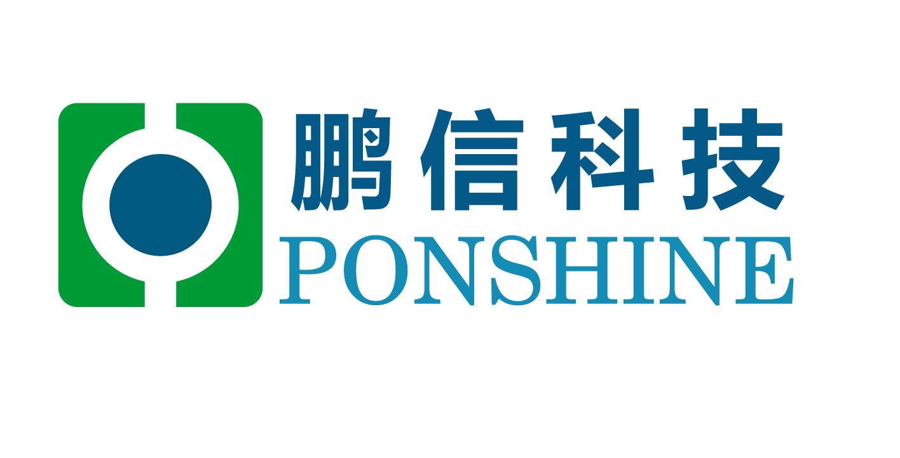
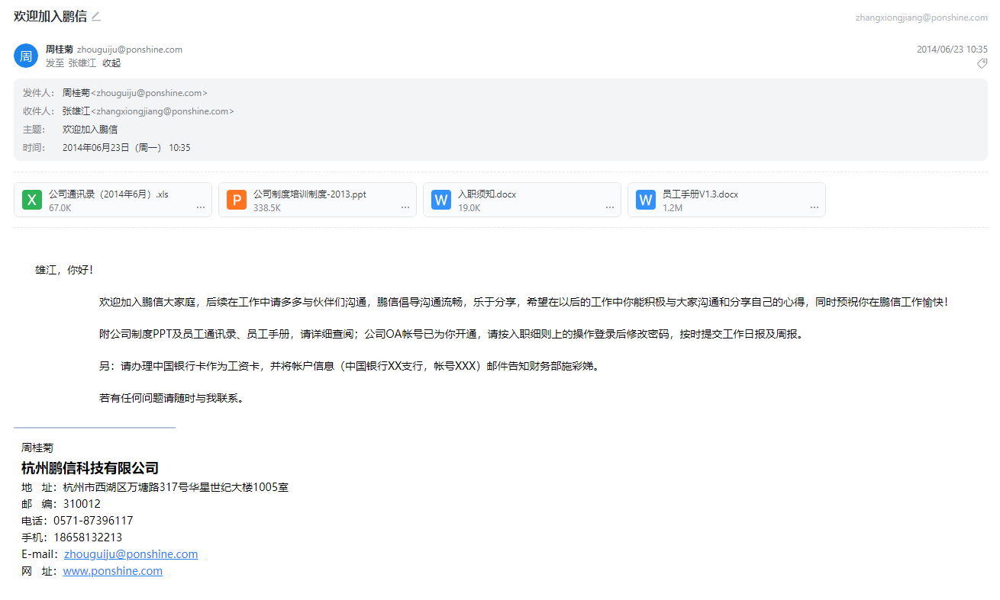
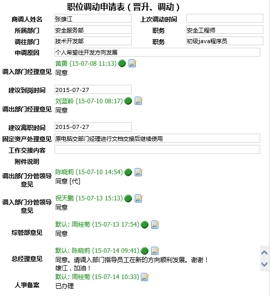
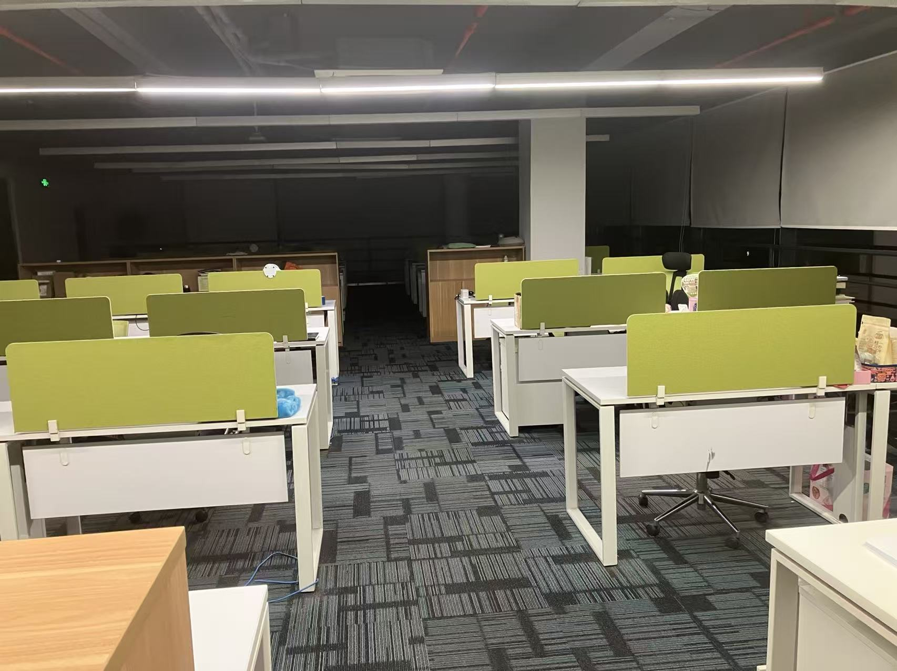
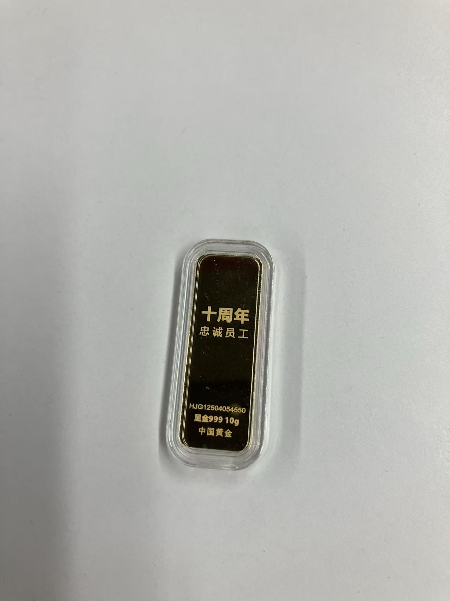
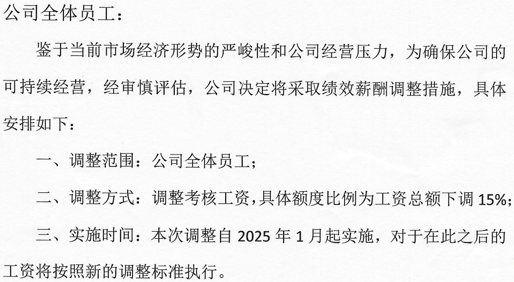
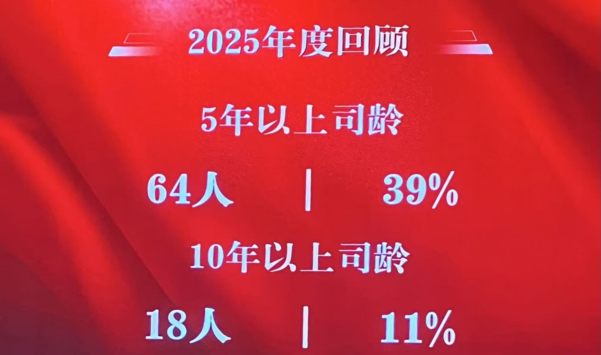

= 离职了
pxzxj; pudge.zxj@gmail.com; 2026/08/04

是的离职了，已经第四天，自七月始至七月终，十二年鹏信职业生涯正式结束，以一个从没预期到的方式。

== 个人回顾

=== 初入职场（2014.6-2015.7）

2014年毕业季，因为上一年考研失败以及所学数学专业的原因找工作很不顺利，
有过几次辅导机构的教师面试机会但基本不能通过试讲，
最后终于通过了一个不知名的机构面试但在实习半天之后就放弃了，
因为实在不甘心此后数年翻来覆去教授这些早已厌倦的初中知识

6月初临近毕业非常焦虑，不记得是因为自己投递还是辅导员推荐接到了鹏信科技的面试邀请，
面试有两轮第一轮是些简单的笔试写一些查询SQL之类，第二轮是老板也就是陈总面试差不多算是闲聊了，
印象最深的是陈总询问期望薪资我回答2k😅，彼时我还不知道杭州有最低工资标准这些事情，当时只是很急迫的想要这份工作

可能是因为我卑微的态度或者其他什么原因总之最终如愿得到了这份工作，薪资是3k，工作地点在滨文路66号移动公司，
岗位名称叫做安全工程师，尽管当时我还完全不清楚安全工程师是做什么的。约定了6.23入职，实习一周到7.1开始试用期

尽管之前有想到上班定然不像在学校那么美好，但其中的困难和痛苦仍然远超预期，入职第一天就要立刻开始干活基本没有学习适应的时间，
当时整个团队正处于动荡期，总数5-6人的团队只有一个人留下其余都准备离职或者已经离职，我的指导老师李平也是刚从其他部门调过来完全不熟悉。

工作内容可以说并不复杂，大多数时候是一些excel数据的整理分类，但由于是一个维护岗位需要不时地跟甲方客户进行沟通还涉及一些跟其他厂商的协作，
对一向内向的我来说这一点颇为挣扎

在这样一天天的煎熬中团队的成员慢慢稳定下来，我也对工作内容逐渐熟悉不再像之前那样磕磕绊绊。这个岗位全称其实是安全扫描工程师，主要是负责扫描移动内部设备的合规、漏洞、弱口令，
其中漏洞是使用绿盟RSAS扫描的，合规和弱口令是使用公司自研工具扫描的，扫描之后就是结果的整理、通报、整改、重新扫描这些流程，这份工作最大的要求其实是细心，扫描结果整理不对可能影响后续所有工作流程。

尽管工作熟悉之后不再那么痛苦，但我的生活状态还是很糟糕，主要问题是我的工资太低了，扣除五险一金后大约是两千五左右，再加上三百左右的误餐补贴，而房租就要650，
因此只能维持每月的基本支出，碰到一些突发状况就无能为力了，有一次我的手机坏了最后换了一个最便宜的诺基亚大约两百块。这样窘迫的状况一直到发了年底双薪和年终奖后才稍有好转

在工作中我也慢慢开始学习一些计算机基础知识、Linux命令、漏洞原理等等，李平介绍熟悉这些知识之后可以慢慢接触渗透测试相关内容，终极阶段是成为一个厉害的黑客😂，黑客啊！千里之外控制别人电脑如探囊取物！

当然一切都还很遥远

在阅读完《鸟哥的Linux私房菜》后合规扫描结果我已经基本能够理解了，但是要理解漏洞的扫描结果难度却大得多，
以典型的Struts 2漏洞为例，让一个不懂Java EE不懂Struts 2的人仅根据扫描结果去理解漏洞原理这显然是不可能的，
于是我萌生了一个想法——做开发

*开发人员是整个IT行业的核心，开发是创造，运维不过是在此基础上维护而已，没有创造何来维护*

在短暂的学习php后我找到了一份php开发的工作，离职之时鹏信的领导提议可以在公司内转岗，不过仍然需要面试。
面试同样是两轮，第一轮是技术开发部经理黄勇，第二轮是陈总，而今已经记不得当时面试的内容了最后自然是通过了于是确定了转岗

NOTE: 当时选择php是因为觉得Java人数太多了，现在看来当然很愚蠢可笑，Java是多么庞大而繁荣的生态啊！
但是当时身边并没有从事Java开发的朋友咨询也没有LLM来提供建议只能摸着石头过河了

此刻看着这份老旧模糊的转岗申请单和陈总的鼓励仍旧觉得无比幸运，如果没有这样一个机会现在的境遇一定会更差，
当时可以说技术开发部是不需要我这个人的但仍然给了我机会，这份恩情一辈子都无法忘记

=== 开发入门（2015.8-2016.8）

2015.7.27终于如愿到了技术开发部，这里的环境要比在移动的好很多，工作时候都很安静，我很喜欢这里

早年技术开发部除了Java开发工程师之外还有一个脚本开发工程师的岗位，因为多个项目都使用了 `ScriptEngine` 执行JavaScript脚本这样的设计，
我当时便是担任一名脚本开发工程师，参与的项目仍然是之前做合规弱口令扫描的项目，只是从使用者转变为了开发者

坦白说我在软件开发上是有一定天赋的，在开发部我进步很快，没多久就能独立完成项目所需脚本的开发，也逐渐协助处理一些扫描结果相关的问题。
于此同时我阅读《Java编程思想》、《JQuery入门》这些书籍学习JavaEE技术并与项目代码相互印证。尽管还没有真正参与到Java开发中但每天能感觉到自己的进步，每天过的很充实

于此同时生活的困顿仍在持续，技术开发部在公司办公，因此我要在西湖区重新租房，这里的租金要比之前高很多，我租了一个900的顶楼，而此时的工资不过是3500，可想而知过的是什么日子了。
最破防的一次是发生在重新租房一个月后，房东突然通知要在3天内搬走之后就要砸墙了，当时是杭州为了G20在做老小区改造，我坐在书桌前无比沮丧好想回到家乡，但最后也只能收拾心情重新找房子

日子继续往前走，我贪婪地学习所有项目所需的知识，Oracle、Spring、Struts 2等等，等到了2016年春我已经能独立完成项目几乎所有开发工作了，
而在一次脚本考试通过后在我的主管徐路平的极力争取下我的薪资终于涨到了6k，日子好起来了！

这一年徐路平给了我很多帮助，规划学习路线、介绍项目功能、制定开发计划等等，他是一个很负责任的人，是一个难得的跟员工站在一起的领导，当然此后他也不断高升此处暂且不提

之所以把这段入门期定在了2016.8是因为当时公司换了地址，从华星世纪大楼搬到了余杭区的乐富海邦园，那就把在华星世纪大楼的这一年作为开发入门期吧

=== 开发进阶（2016.8-2021.9）

2016年公司发展势头良好人数不断增加，工位也有些紧张，加上余杭区的一些政策支持公司领导决定搬到余杭区的乐富海邦园

当年余杭区还不像如今这么发达，我们是乐富海邦园第一批入驻的公司，周围一片荒凉，园区也是空空荡荡，
我们在14幢楼的9层和10层，工位远比人数多因而空间很宽敞，绿色的隔板有一种清新的气息

由于我在之前参与的项目表现不错，后来逐渐被当时的技术开发部经理黄勇安排一些其他研究工作例如分布式会话、Rest API、微服务等等
现在看来当时的很多研究是毫无意义的，以分布式会话为例直接使用 `spring-session` 这样成熟的框架即可根本无需研究，
更不用提微服务这样复杂的架构设计交给一个不足两年的Java开发者研究自然也是一个笑话

*Java技术学习通常初期进步很快但掌握常用技术栈后再进一步深入就非常困难了，要依赖之前计算机基础是否扎实以及个人悟性*，
我自然也逃不出这个规则，所以后续的几年进步缓慢，
虽然也去回头学了一些《操作系统原理》、《计算机网络基础》这样的课程但也没有体现出明显效果，
对此我也无计可施只能继续学习，从Struts 2 到SpringMVC再到Spring Boot

在Java学习的早期我常常会通过看很多的视频教程并跟着教程做一些项目练习，
但到了中期大约2018年前后我找到了新的学习方法就是去阅读官方文档，这样更高效更准确的学习，这一点可以参考 https://pxzxj.github.io/articles/how-to-learn-spring.html[Spring框架学习方法]，此处不再赘述

在2020年可能是厚积薄发也可能是灵光一现我产出了两个不错的项目，一个是一个JetBrains插件 https://plugins.jetbrains.com/plugin/14018-vcslabel/[VCSLabel]，
另一个是公司内部使用的 `ponshine-connect`，可以非常简洁高效的和设备建立远程连接并发送指令

这个进阶期当然没有一个准确的结束时间，之所以定在了2021.9是因为当时通过了 `乌鸫科技` 的面试但在鹏信涨薪后放弃了，
当时已经预料到这是最后一次涨薪了，于是逐渐开始了躺平生活。
只是没预料到还会有降薪😭...

=== 安于现状

*软件开发人员的能力成长固然离不开个人的学习，但也很大程度上依赖参与的项目，要在项目开发中不断解决问题积累经验才能真正提升能力。
因此在软件开发的面试中很看重项目经验*

剩下的这些年也许可以缩短为一周甚至一天，由于公司的项目早已熟悉，因而在项目开发中再也得不到成长，同时学习的动力也逐渐消退，每个月只是按时完成工作拿到工资

值得一提的是在进入公司10年后收到了10周年礼物

疫情之后尤其是徐总去世之后公司江河日下连年亏损，开始是年终奖变少，后来是年底双薪，
直到2024年底最炸裂的消息发布：全员降薪15%

这次降薪大约有10%员工选择了离职，主动离职或者协议离职，
我在躺平了多年后也丧失了出去的勇气和能力，因而接受了降薪，当时我们便有预感公司这样的颓势会持续，
果不其然2026年春又迎来了一次降薪，这也最终导致了我的离职

=== 离职

2026年4月公司公布了新的薪酬结构，将原本月薪中的一部分转移到每个季度结束和年底结束根据公司经营情况发放，这明显是一次变相的降薪

这第二次降薪让公司大部分员工都不能接受，有些选择直接离职，有些选择协商离职或者仲裁

我思虑良久后打算在7月或者8月主动离职，但必须承认我是个软弱的意志不坚定的人，
在得知部分举报欠薪的员工会得到处理后我也选择了举报，于是一切都结束了，也就有了这篇文章

离开一个呆了十二年的地方是什么感受？有一些不舍更多的是解脱，降薪后的纠结以及与流氓HR的拉扯早已让我感到厌倦，
能早日结束这一切真的是一种解脱!

== 公司总结

=== 领导人

陈总，占据公司八成股权，身兼总经理和董事长两个职位，是这个公司毫无疑问的BOSS，
早年据说是某通信公司的顶级销售，积累了大量人脉，现在公司里一大半的项目都源于她的人脉。
前期主要是浙江移动项目，后来也在不断拓展新的市场，例如水文、浙能、其他运营商等业务

在这样的背景下陈总在公司里自然是一言堂，她的决策无人能质疑，早年市场环境较好公司蒸蒸日上不断扩张，
近些年由于市场环境变差加上她的一些错误决策公司连年亏损，不断降薪裁员。也许是她自知管理能力不足，
近些年频繁带领年轻的公司中层参加管理学培训课程，收效甚微

作为一家软件公司的领导人，陈总缺乏对软件开发最基本的认知，
总是天真地以为可以通过一小部分人的研究成果或者新技术的引入来大幅降低开发成本，于是不断地组建所谓的研究创新团队、专家团队并且与低代码公司合作

严格来说第一个想法没有根本性的错误，软件开发领域有太多天才改变世界的案例了，从Linus再到比尔盖茨再到james gosling，
但要注意这些都是 *天才*，凡人能做的只是追随天才的脚步而已。
自我从事JavaEE开发以来就亲眼见证了web框架从Struts 2到SpringMVC再到Spring Boot的迭代、Intellij IDEA的崛起以及近两年AI编程的火爆，
开发门槛越来越低效率越来越高，所以对于中小企业来说要做的只是 *wait,wait,wait...* 而已，完全没有必要组建所谓的研究创新团队白白浪费成本。

NOTE: 在我离职前夕，最后的研究部门 `技术发展部` 也濒临解散，成员分布到了各个项目组中

如果说组件研究创新团队只是高估员工能力的话，那么引入低代码就是一个彻头彻尾的笑话

大概在2023年软件开发界不知道从哪儿刮来了一阵低代码的妖风，提出可以把一些业务功能封装成为模块之后在一个可视化的界面连接就可以快速开发一个软件出来，
这显然是对软件开发封装思想的老调重弹，使用低代码软件不啻于大清朝闭关锁国，意味着和全世界宏伟繁荣的软件开发生态说再见。
无奈陈总和当时的徐总仍然决定在公司内试用一款叫做小海牛的低代码平台，结果是一地鸡毛，留下的技术债务，给问题排查和代码交接带来很多额外的负担

工作之外陈总平易近人和蔼可亲，她能叫得上所有员工的名字，关心员工的生活状态，跟我参加工作前想象中的老板完全不同，
不过经过这两年的连续降薪以及流氓HR的恶心事儿，之前留下的好印象也几乎消失殆尽了

=== 公司制度

2025年前公司一直实行朝九晚五的考勤制度直至2025年调整为了8:30 am - 5:30 pm，
加班至 7:00 pm后可以开始提交加班单，加班时长可以等比兑换为调休时长

总体上公司管理比较宽松，在没有紧急事务的情况下工作时间也可以随意外出刷视频玩手机之类，
甚至加班单也可以在5:30 pm开始提也能审核通过

在这样宽松的管理下公司氛围轻松，同事之间相处融洽，但也免不了工作效率偏低，后期引入的工时制度也只是流于形式。
很多员工在跳槽到其他公司后由于不能适应还会选择回来。最终很多不求上进贪图安逸的“懒狗”都留了下来

绩效考核和薪资制度是一家公司最重要的制度，而鹏信在这一点上做的也很差，2019年之前会针对开发人员进行专门的定岗定级考试，
但显然这样的考试并不能代表员工的能力和贡献因此之后就废除了，
但不论是否施行定岗定级员工涨薪的数额与年终奖的数额完全取决于上级领导的主观评价，这样纯主观的评价必然会带来不公平。
而不公平远不止如此，传言在2025年全体降薪后又悄悄恢复了一部分员工的薪资。

除了薪资外还有各类津贴如通讯补贴、高温补贴、书报补贴等，但2020年开始为了节省成本悄悄取消而今只剩下每月100的通讯补贴了

NOTE: 再次痛批流氓HR，很多制度的变化都是遮遮掩掩不正式通知，不只是津贴还有病假扣款等等

=== 奇葩事儿

鹏信科技员工数不是很多，大部分时候都不到200人，但是奇葩事儿还真不少，简要列举如下

1. 可能因为同事相处融洽，相互间借贷频繁，自然也产生了不少纠纷
2. 一个老板极为器重一路高升的领导赵xx找老板借钱200w还不上最后开除
3. 办公室恋情很多，甚至高层领导主动介绍
4. 某中层领导明目张胆好色，只招收女下属，有传言骚扰其中一个女下属
5. 老板因为客户的诬告直接开除两个出差多时想要回家过中秋的员工
6. 两个员工利用线上打卡软件的漏洞长期伪造打卡记录，被发现后只是口头警告

=== 后降薪时代

2026.4降薪前公司人数约为160左右，至7月底我离职后剩余约100人，具体人员变更印象流统计如下

[horizontal]
裁员 :: 10+
主动离职 :: 10+
协议离职 :: 30-
涨薪留下 :: 10+
接受降薪 :: 90-

可以看到员工数还是减少了相当多的，不过貌似没有对项目产生很大影响。这样的断臂求生策略能否让公司生存的更久就要等待时间的检验了

== 杂谈

=== 机遇与努力

这是一个老生常谈的话题了当然也没有一个准确的答案，不过结合本国的国情来看应当还是机遇更重要些，
那么多大学毕业后找不到工作的大学生并不是他们的能力不如别人只是缺少一个机会而已。
所以“付费上班”也并不是那么可笑，职业生涯初期在一个好的环境中成长学习付出少量金钱也不是不可以

=== 大厂梦

“996是福报” 马云曾经一度因为这句话被骂上热搜，
但是对于那些长期在中小企业挣扎求存的IT行业从业者而言，谁不期望能够有一天进入大厂，用几年的青春换取巨量的财富。
正如鲤鱼跃龙门，正如结丹进阶元婴，那是另一个世界

从2020年开始我也曾多次面试一些大厂，大部分时候都是一轮游，最接近的一次是通过了乌鸫科技的面试。
现在回顾往昔仍然有些遗憾，身在IT行业终究没能到那个世界看一看，那里的工作流程是什么样的？怎么做bug管理？怎么使用AI工具？
是不是当时不那么懈怠好好准备就能进去？

=== 认识到平庸

“你是什么时候意识到自己可能就要这么平庸的过这辈子了？” 这是一次跟朋友聊天时谈到的话题，当时我们都处在三十到三十五岁之间，
而我们的答案基本一致都是在三十出头有了这样的想法。是的，在这个国家在这个时代超过三十岁就会感觉做什么都有点晚了