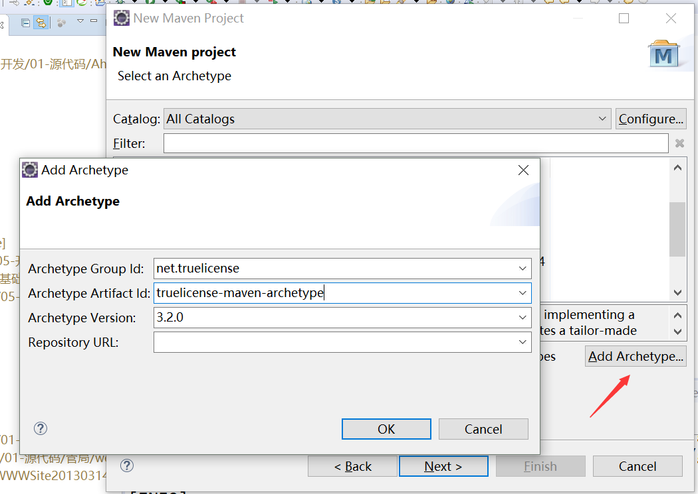
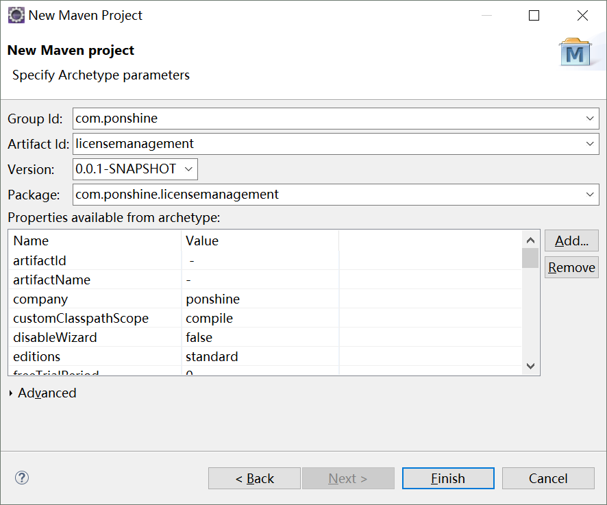
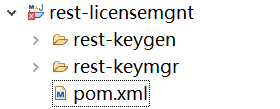

= TrueLicense使用入门
pxzxj; pudge.zxj@gmail.com; 2025/04/22

== 简介

TrueLicense是一个在JVM上运行的许可证管理的商业开源引擎，由于其精巧的模块化设计，它即支持简单的许可证管理模式，也适用于多种复杂的许可证管理场景，如试用期、同软件多个版本、国际化等

== 实现原理

与SSL的证书验证方式类似，TrueLicense也是以公钥加密体系为核心实现验证；初始生成一对密钥，许可证生成器使用私钥加密验证信息后生成许可证文件，软件运行后使用公钥解密许可证信息完成验证

== 生成Liscense

为了方便用户使用，TrueLicense提供了一个Maven Archetype来生成模板代码，下面以Eclipse为例介绍TrueLicense Maven Archetype的使用方式

第一步： New -> Maven Project,在Archetype选择界面中点击Add Archetype新增一个Archetype如下

在New Maven Project窗口中，对左下方的属性进行赋值，其中company、password、subject为必填属性，下面对这些属性的意义进行说，其它属性的说明可以参考官方文档

[horizontal]
company  :: 生成的许可证中的公司名称
password  :: 加密生成的密钥对时使用的密码，密码要满足复杂度要求，包含大小写字母数字特殊符号且八位以上，否则使用时会抛出弱口令异常
subject  :: 许可证中的主体，也是验证的部分，验证失败时抛出异常；如果要限制软件仅能在特定主机上运行可以考虑使用主机唯一标识，如mac地址，硬盘序列号等信息；否则所有许可证的subject可以相同。subject值此时可能尚无法确定，可以先随便填一个值后面再修改。

二步完成后会生成一个Maven项目，内部包含三个子模块，分别为项目名后加keygen、keymgr、keymgrsrv

项目生成完成后在父项目目录下执行mvn clean install –Pintegration-test构建项目，项目构建完成后会生成诸多文件，这些文件的说明参考官方文档

此处需要使用的文件有两个分别为 `$\{projectName}-keygen/target/generated-sources/java/$\{packageName}/LicenseManager.java` 和 `$\{projectName}-keymrg/target/generated-sources/java/$\{packageName}/LicenseManager.java` 这两个文件分别可以用于生成许可证和验证许可证，生成许可证使用的私钥和验证许可证使用的公钥分别是 `$\{projectName}-keygen/src/main/resources/private.ks` 和 `$\{projectName}-keymrg/src/main/resources/public.ks`

上一步构建完成的项目可以用于生成License并校验，但在实际业务场景中更多得是要求在已有的web项目中集成License管理功能；下面以两个已存在的web项目中的main方法为例来说明集成方法

当前存在两个web项目rest-keygen和rest-keymgr，都使用流行的ssm框架进行开发，分别用于生成License和验证License

先在 `pom.xml` 中加入truelicense的依赖如下

[source,xml,subs="verbatim"]
----
<dependency>
            <groupId>net.truelicense</groupId>
            <artifactId>truelicense-v2-json</artifactId>
            <version>3.2.0</version>
</dependency>
----

将之前生成的keygen项目中的 `LicenseManager.java` 和 `private.ks` 分别复制到rest-keygen项目的 `src/main/java和src/man/resources` 中；运行如下的main方法就可以生成一个License文件了

[source,java,subs="verbatim"]
----
VendorLicenseManager manager = LicenseManager.standard;
LicenseManagementContext context = manager.context();
License bean = context.license();
Sink sink = context.pathStore(Paths.get("C:/Users/pxzxj/22.lic"));
context.stdout();
manager.generateKeyFrom(bean).saveTo(sink);
----

以上代码生成的License文件中的subject值就是第二步创建项目时subject属性的值，这个值以LicenseManager的一个似有final变量保存；这样的设计显然计划永远不修改subject的值，需要修改时重新执行第二步生成新的项目代码
作者并未提及这样设计的原因，也许他认为购买者并不会将买到的License传播给他人使用，然后我们为了安全起见要求每个License的subject都不相同所以需要修改LicenseManager的SUBJECT属性为非final并提供一个修改此属性的public方法

== License安装验证

将之前生成的keymgr项目中的 `LicenseManager.java` 和 `public.ks` 分别复制到rest-keymgr项目的 `src/main/java和src/man/resources` 中；类似的删除LicenseManager.SUBJECT的final修饰符并提供set方法；运行如下main方法安装并验证License

[source,java,subs="verbatim"]
----
ConsumerLicenseManager manager = LicenseManager.get();
LicenseManagementContext context = manager.context();
Source source = context.pathStore(java.nio.file.Paths.get("C:/Users/pxzxj/22.lic"));
manager.install(source);
manager.verify(source);
----

== 高级

上文描述了Truelicense的最简单使用，实际上它还支持很多高级用法，如一定时长的试用期、同软件多个版本、部分关键代码字节码混淆处理保证安全等等，这部分内容参考官方文档