= 20个月漫漫讨债路：认识一个烂人的代价有多大
pxzxj; pudge.zxj@gmail.com; 2025/02/22

2025年2月21日星期五，天气阴冷，小雨时断时续，拖延了两天后最后一个将工位从9楼搬到了11楼，
徐某发消息谈了自己的近况和后续计划，于是我再次问及还钱计划并期望离职前归还却得到了下面的答复

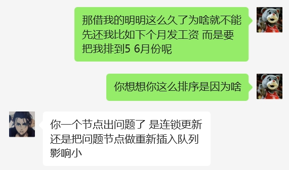

尽管已经多次见识到此人的自私和无耻但看到这样的答复仍然惊掉下巴，我为什么要认识这样一个人啊！

== 2023年前

徐某是2019年7月入职的，入职时工位恰好在我旁边，因为同玩一个游戏的缘故很快变得熟络起来，
之后徐某便时而会找我借钱，数额不超过五千，一般1个月内会归还

2022年4月徐某离职去了新公司之后又在11月去了上海的另一家公司，此间一直还保持联系，
徐某从出去后第一家公司离职后就表达了想要回来的想法，几番周折终于在2023年回来了

== 2023年

=== 3月

3月4日徐某还未重新入职就提出了借钱，并且只是短短数个小时，我虽然不情愿最终还是借了，结果确实当天就归还了，
但当时其实也是质疑他的行为方式的，只是周转一下为什么这么急迫几个小时都不愿意等？

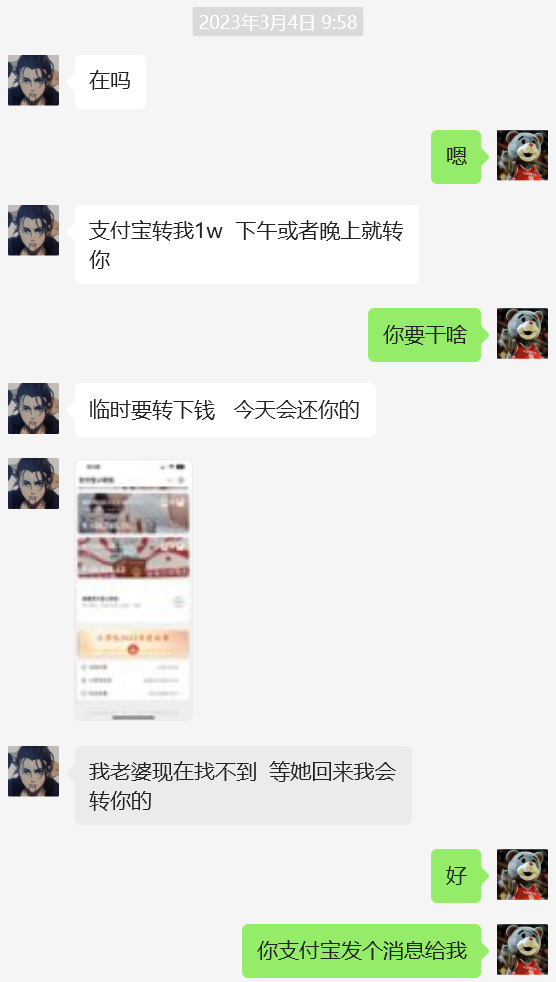

3月13日深夜徐某突然打来了电话表达自己结婚需要用钱，而自己和女朋友的钱在小金库不愿意动用云云，考虑到对方是终身大事我最终还是借了1万

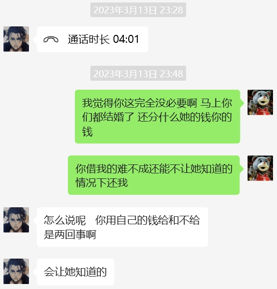

=== 4月

4月份的一天夜里又急迫的借钱第二天都等不得，我实在是难以理解这种做法最终没有借

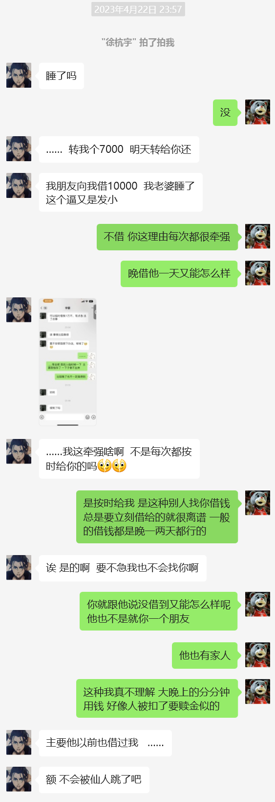

=== 6月

6月17日的下午徐某又急迫的打了电话过来说要买东西要借12500表示一周内归还，
我思虑再三觉得不论如何都是同一个公司里的同事想必问题不大最后还是借了，每次想起这件事都后悔莫及

三天后对方突然提出下楼聊一下，聊天中吐露了17日借钱的真实意图，犯了大错损失了几十万，除了我之外还借了公司中多个同事

骤闻此事我自然期望早日拿回我的钱，但彼时更多的也是对徐某的痛惜，一个大好青年有和谐的家庭高薪的工作温柔善良的女朋友，
本可以幸福度过一生却亲手毁掉了一切。

经过数日痛苦的挣扎后徐某也基本从重大的打击中走了出来决定继续努力工作还钱弥补一切，
考虑到对方的艰难处境，我们约定了在2023年底前和2024年底前各还一半的方案，这个时间毫无疑问地排在所有借钱人的最后一名

== 2024年

=== 1月

公司往年会在1月份发放上一年的年底双薪，也是跟徐某后来口头约定的还一半的时间，但由于公司的特殊情况临时通知双薪在2月份放假前发放，
徐某按照发放双薪的计划同时答应了我和另一个同事还钱，结果双薪未发放他选择了还另一个同事，彼时我自是颇为不爽的，但考虑到对方掌握着主动权还是勉强答应下来，
当然就算我不答应也无能为力

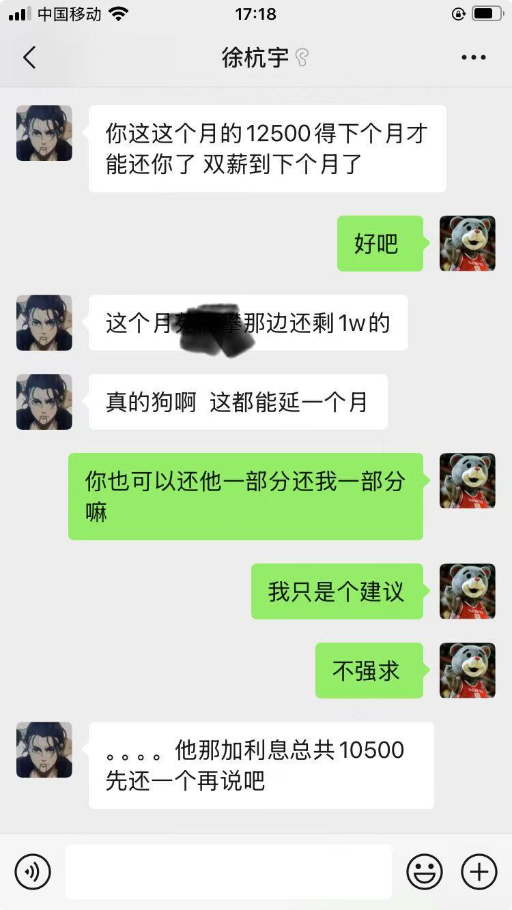

=== 2月

由于徐某评得了上一年的优秀员工得到五千奖金，因此一次性还了15000比之前约定的多

=== 5月

5月份跟徐某再次确认明确的还钱时间（因为最早约定的年底前显然比较模糊），对方给出了8月份的答复

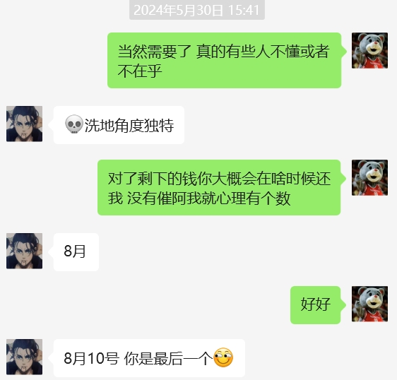

=== 6月

6月的一天没想到徐某在还有7500未还的情况下再次提出了借钱，考虑到对方说到情况确实颇为严重我又一次借给了对方，这样欠的钱变为9100

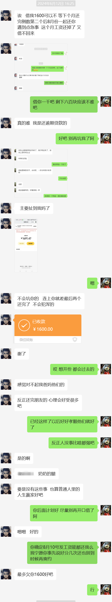

=== 7月

7月20日徐某竟然再次提出了借钱，理由是朋友的朋友生病了找他要钱，这样的理由显然毫无道理，
拒绝了对方后对方又提出了推迟还钱时间，我接受了

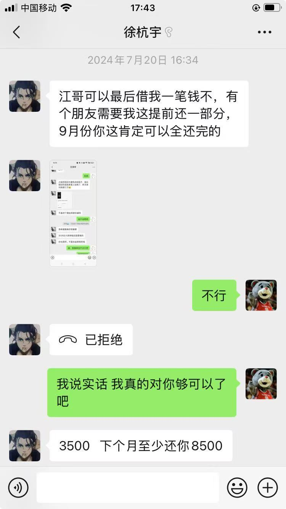
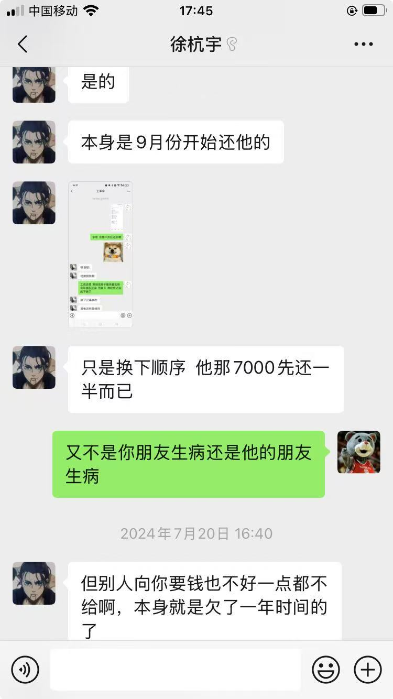
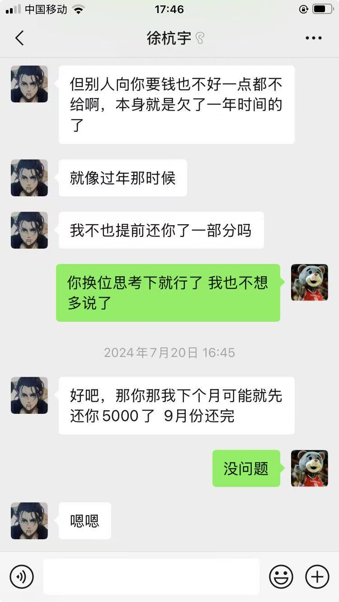

=== 8月

8月6日对方竟然再次提出了推迟还钱，我实在是愤怒之极，一步步的忍让换来的是对方的得寸进尺

于是当天与徐某再次进行协商，结果是约定当月还4100，年底前还5000，由于对方表露了离职的想法所以补充了如果离职就离职前还，
这个补充说明原本是为了考虑年底前离职的意外情况，结果万万没想到会被对方作为年底前不还钱的依据，当然这是后话了

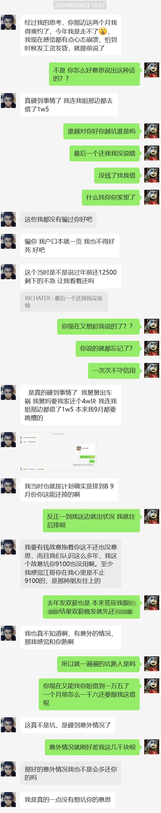

仅仅在约定后一天徐某又出了意外，短短一个月时间先是朋友的朋友然后是舅舅现在到了他自己生病，我实在不知道该说什么了

结果当月还了3100，后来又在国庆还了1000，遗留5000未还

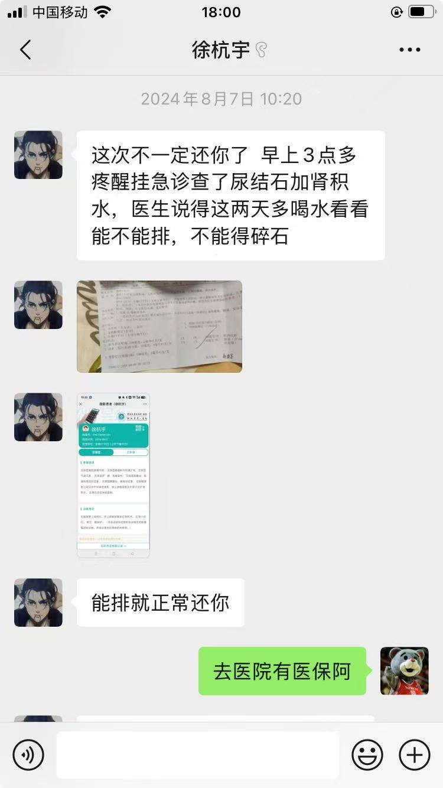

=== 11月

11月4日已经临近年底我再次问起了还钱的事儿，对方以当时说的是年底或者离职前还为借口不肯还钱，
而我当时没想起来离职前还的说法，因为最后期限是年底，离职前只是一种意外情况的补充说明

当徐某说出年底没离职所以不还的话时我对他已经完全失望，只想早日与他划清界限，于是提出了只还三千就彻底了解的方案，结果他如约在12月10日还了三千

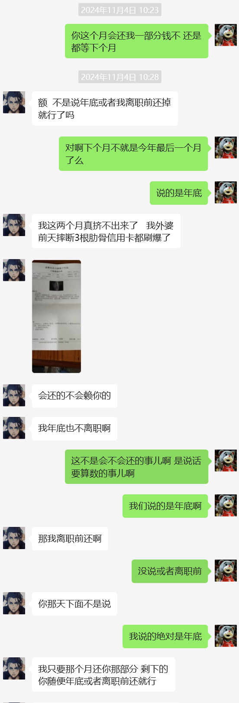

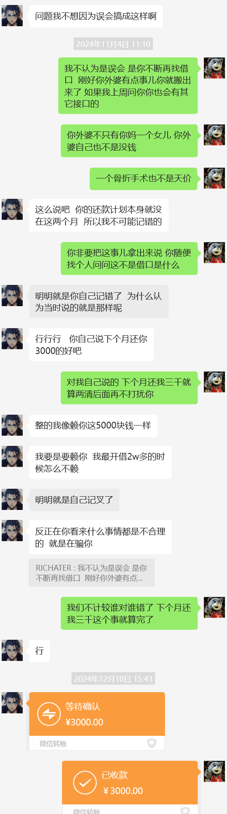

=== 12月

尽管这件事儿已经宣告结束，但对我来说绝谈不上圆满，我事后不断回想当时的场景，有些后悔当初一气之下提出的放弃两千的方案

在一个失眠的早上我的愤怒悔恨无处宣泄于是发了条 `别给同事借钱` 的朋友圈，徐某看到后主动提出把两千还我，
于是我又觉得他还没有那么十恶不赦，还是有些底线的

== 2025年

=== 2月

时间回到昨天徐某表露出离职的想法后我又问起了还钱的事儿，以及为何欠我的时间已经接近两年而不先还我而是先还其他人，
结果就是再次刷新我对他无耻底线的认知

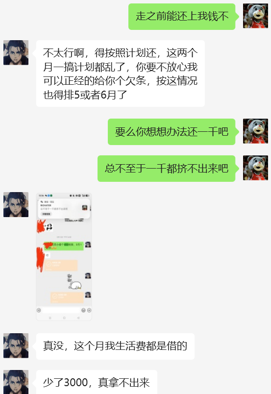

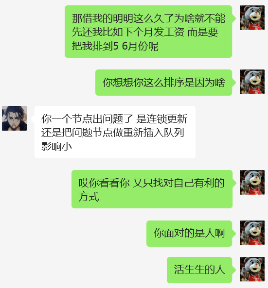

